# Pico-8 Art Carts

## 2022

#### Mar

[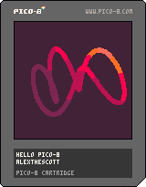](https://github.com/alexthescott/Computational-Art-in-Pico-8/tree/main/colorful_squigle)
[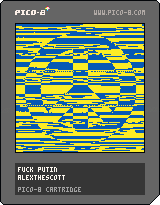](https://github.com/alexthescott/Computational-Art-in-Pico-8/tree/main/fuck_putin)

#### Feb

[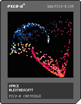](https://github.com/alexthescott/Computational-Art-in-Pico-8/tree/main/space)

#### Jan
[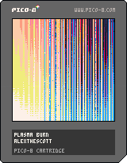](https://github.com/alexthescott/Computational-Art-in-Pico-8/tree/main/plasma_burn)
[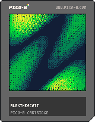](https://github.com/alexthescott/Computational-Art-in-Pico-8/tree/main/plasma_moss)
[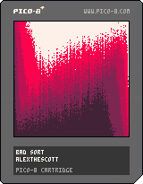](https://github.com/alexthescott/Computational-Art-in-Pico-8/tree/main/bad_sort)
[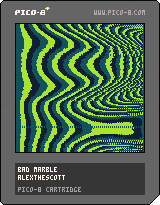](https://github.com/alexthescott/Computational-Art-in-Pico-8/tree/main/bad_marble)

## 2021

#### Dec

#### Nov

[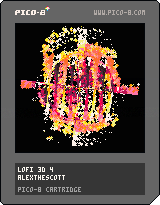](https://github.com/alexthescott/Computational-Art-in-Pico-8/tree/main/lofi_3d_4)

### Oct
[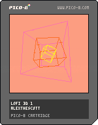](https://github.com/alexthescott/Computational-Art-in-Pico-8/tree/main/lofi_3d_1)
[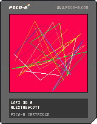](https://github.com/alexthescott/Computational-Art-in-Pico-8/tree/main/lofi_3d_2)
[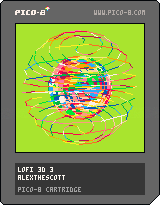](https://github.com/alexthescott/Computational-Art-in-Pico-8/tree/main/lofi_3d_3)
[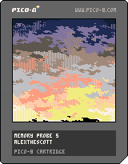](https://github.com/alexthescott/Computational-Art-in-Pico-8/tree/main/memory_probe_5)
[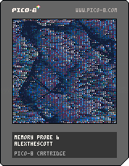](https://github.com/alexthescott/Computational-Art-in-Pico-8/tree/main/memory_probe_4)
[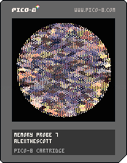](https://github.com/alexthescott/Computational-Art-in-Pico-8/tree/main/memory_probe_4)
[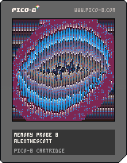](https://github.com/alexthescott/Computational-Art-in-Pico-8/tree/main/memory_probe_4)

#### Sep
[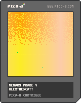](https://github.com/alexthescott/Computational-Art-in-Pico-8/tree/main/memory_probe_4)
[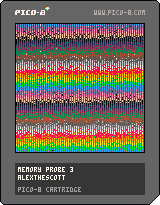](https://github.com/alexthescott/Computational-Art-in-Pico-8/tree/main/memory_probe_3)
[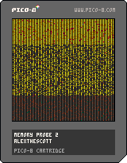](https://github.com/alexthescott/Computational-Art-in-Pico-8/tree/main/memory_probe_2)
[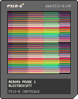](https://github.com/alexthescott/Computational-Art-in-Pico-8/tree/main/memory_probe_1)
[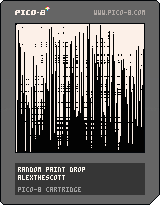](https://github.com/alexthescott/Computational-Art-in-Pico-8/tree/main/random_paint_drop)
[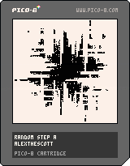](https://github.com/alexthescott/Computational-Art-in-Pico-8/tree/main/random_step_a)
[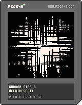](https://github.com/alexthescott/Computational-Art-in-Pico-8/tree/main/random_step_b)
[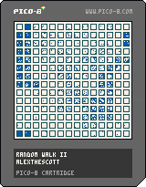](https://github.com/alexthescott/Computational-Art-in-Pico-8/tree/main/random_walk_ii)
[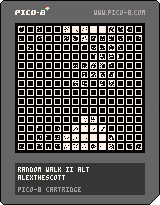](https://github.com/alexthescott/Computational-Art-in-Pico-8/tree/main/random_walk_ii_alt)

[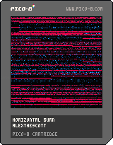](https://github.com/alexthescott/Computational-Art-in-Pico-8/tree/main/horizontal_burn)
[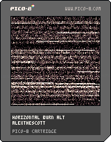](https://github.com/alexthescott/Computational-Art-in-Pico-8/tree/main/horizontal_burn_alt)
[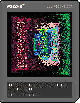](https://github.com/alexthescott/Computational-Art-in-Pico-8/tree/main/its_a_feature_2)

#### Aug

[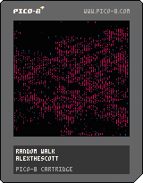](https://github.com/alexthescott/Computational-Art-in-Pico-8/tree/main/random_walk)
[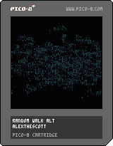](https://github.com/alexthescott/Computational-Art-in-Pico-8/tree/main/random_walk_alt)
[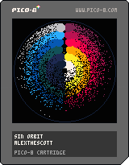](https://github.com/alexthescott/Computational-Art-in-Pico-8/tree/main/sin_orbit)
[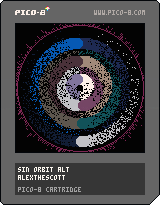](https://github.com/alexthescott/Computational-Art-in-Pico-8/tree/main/sin_orbit_alt)

#### July

