# Pico-8 Art Carts

[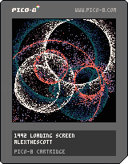](https://github.com/alexthescott/Computational-Art-in-Pico-8/tree/main/1992_loading_screen)
[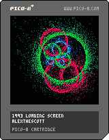](https://github.com/alexthescott/Computational-Art-in-Pico-8/tree/main/1993_loading_screen)

[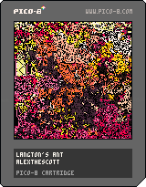](https://github.com/alexthescott/Computational-Art-in-Pico-8/tree/main/bad_ants)
[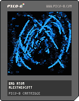](https://github.com/alexthescott/Computational-Art-in-Pico-8/tree/main/bad_atom)
[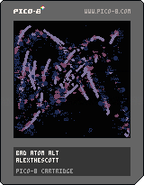](https://github.com/alexthescott/Computational-Art-in-Pico-8/tree/main/bad_atom_alt)
[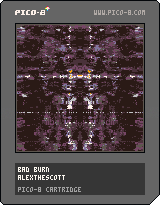](https://github.com/alexthescott/Computational-Art-in-Pico-8/tree/main/bad_burn)
[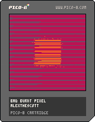](https://github.com/alexthescott/Computational-Art-in-Pico-8/tree/main/bad_burnt_pixel)
[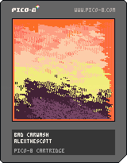](https://github.com/alexthescott/Computational-Art-in-Pico-8/tree/main/bad_carwash)

[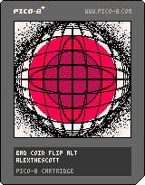](https://github.com/alexthescott/Computational-Art-in-Pico-8/tree/main/bad_coin_flip_alt)
[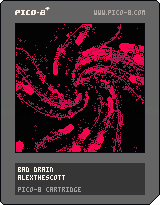](https://github.com/alexthescott/Computational-Art-in-Pico-8/tree/main/bad_drain)
[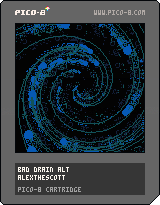](https://github.com/alexthescott/Computational-Art-in-Pico-8/tree/main/bad_drain_alt)
[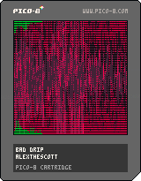](https://github.com/alexthescott/Computational-Art-in-Pico-8/tree/main/bad_drip)
[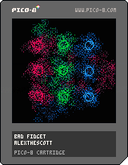](https://github.com/alexthescott/Computational-Art-in-Pico-8/tree/main/bad_fidget)
[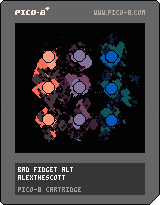](https://github.com/alexthescott/Computational-Art-in-Pico-8/tree/main/bad_fidget_alt)
[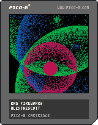](https://github.com/alexthescott/Computational-Art-in-Pico-8/tree/main/bad_fireworks)
[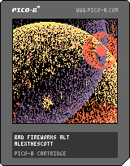](https://github.com/alexthescott/Computational-Art-in-Pico-8/tree/main/bad_fireworks_alt)
[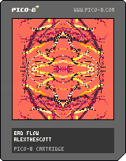](https://github.com/alexthescott/Computational-Art-in-Pico-8/tree/main/bad_flow)
[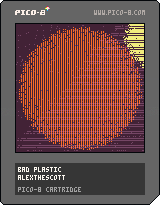](https://github.com/alexthescott/Computational-Art-in-Pico-8/tree/main/bad_plastic)
[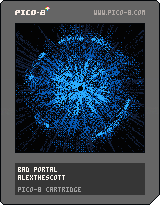](https://github.com/alexthescott/Computational-Art-in-Pico-8/tree/main/bad_portal)
[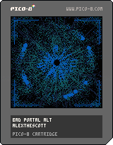](https://github.com/alexthescott/Computational-Art-in-Pico-8/tree/main/bad_portal_alt)
[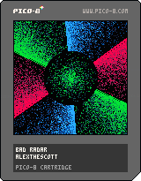](https://github.com/alexthescott/Computational-Art-in-Pico-8/tree/main/bad_radar)
[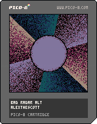](https://github.com/alexthescott/Computational-Art-in-Pico-8/tree/main/bad_radar_alt)
[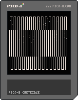](https://github.com/alexthescott/Computational-Art-in-Pico-8/tree/main/bad_slant)
[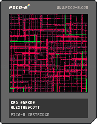](https://github.com/alexthescott/Computational-Art-in-Pico-8/tree/main/bad_snakes)
[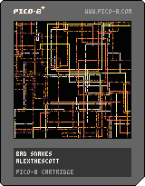](https://github.com/alexthescott/Computational-Art-in-Pico-8/tree/main/bad_snakes_alt)
[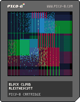](https://github.com/alexthescott/Computational-Art-in-Pico-8/tree/main/block_cloud)

[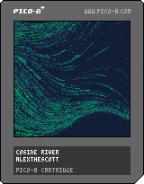](https://github.com/alexthescott/Computational-Art-in-Pico-8/tree/main/cosine_river)
[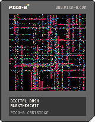](https://github.com/alexthescott/Computational-Art-in-Pico-8/tree/main/digital_dash)
[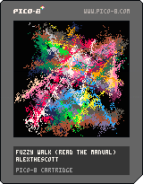](https://github.com/alexthescott/Computational-Art-in-Pico-8/tree/main/fuzzy_walk)
[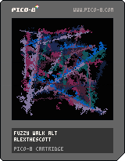](https://github.com/alexthescott/Computational-Art-fuzzy_walk_alt-Pico-8/tree/main/fuzzy_walk_alt)