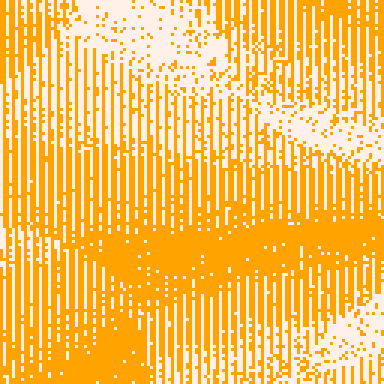
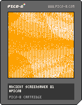

<h1>ancient screensaver 01</h1>

</img>
</img>

``` Lua
-- ancient screensaver 01
pal({[0]=9,7},1)
cls()
r=rnd
t=r()
::♥::
for i=0,512 do
x=r(128)\1
y=r(128)\1
v=(1+sin(t+(y-63)/142-x/3))-cos(t+x/156*(y-64)/55)
v=abs(v)
if v<2 then
pset(x,y,v)
end
end
t-=.0015
flip()
goto ♥
```