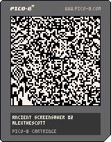

<h1>ancient screensaver 02</h1>

</img>
</img>

``` Lua
-- ancient screensaver 02
camera(1,1)
poke(0x5f2c, 3)
pal({[0]=7,0},1)
cls()
r=rnd
t=r()
q=2+r(510)
u=6+r(32)
::♥::
for i=0,2212 do
x=r(128)\1
y=r(128)\1
v=1+cos(t+(x-u)/32*(y-130)/q*x*y)
if v<2 then
pset(x,y,v)
end
end
t-=.002
flip()
goto ♥
```