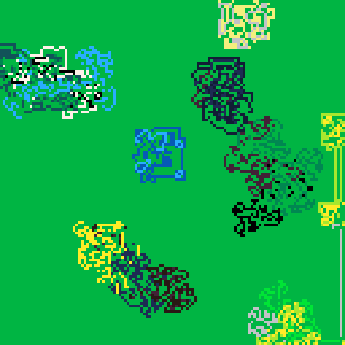

<h1>bad ants</h1>

</img>
</img>

[bad ants ipfs](https://gateway.fxhash2.xyz/ipfs/QmfC6s1ds1czQmU1WxBNbnQNd6Txju7g4MNfgdkB2CU5am/?fxhash=ooh7XBEVBV7GVNCdBEEKAGBJqy8dqpNy7WQ9euhWfURpfrZNCtU)

Eight one dimensional, and eight two dimensional Langton's ants battle for space in a tiny box. Z or X will speed up the step count of the program.

``` Lua
-- langton's ant
-- alexthescott
-- 11/12/21
-- https://en.wikipedia.org/wiki/langton%27s_ant

p1={7,6,135,10,138,11,139,3,131,12,140,1,129,130,128,0}
p2={7,135,10,9,15,143,142,137,14,136,8,2,130,133,128,0}
p3={7,15,143,142,14,8,136,137,9,10,135,138,11,139,12,140}
 
p={p1,p2,p3}
c=rnd(p)
 
pal(c,1)

function forward()
    v=c[1]
    del(c,v)
    c[#c+1]=v
    pal(c,1)
end
 
function backward()
    v=c[#c]
    del(c,v)
    for i=#c+1,1,-1 do
        if i!=1 then
            c[i]=c[i-1]
        else
            c[i]=v
        end
    end
    pal(c,1)
end

for i=1,rnd(16) do
    forward()
end

function new_ant(x,y,c)
	ant={}
	ant.x=x
	ant.y=y
	-- 1:up 2:right 3:left 4:down
	ant.d=1+rnd(4)\1
	ant.c=c
	
	ant.move=function(self)
		pc=pget(self.x,self.y)
		if pc==0 then
			pset(self.x,self.y,self.c)
			self.d+=1
			if self.d>=5 then
				self.d=1
			end
		else
			if pc==self.c and pc%2==0 then
				pset(self.x,self.y,pc-1)
			else
				pset(self.x,self.y,0)
			end
			self.d-=1
			if self.d<=0 then
				self.d=4
			end
		end
		
		if self.d==1 then
			self.y-=1
		elseif self.d==2 then
			self.x+=1
		elseif self.d==3 then
			self.y+=1
		else
			self.x-=1
		end
		
	end
	return ant
end

--[[
d=4+rnd()*28
ant_a=new_ant(64-d,64-d,2)
ant_b=new_ant(64+d,64+d,4)
ant_c=new_ant(64+d,64-d,6)
ant_d=new_ant(64-d,64+d,8)
--]]

ants={}
d=16
for i=1,16 do
	x=rnd(128)\1
	y=rnd(128)\1
	na=new_ant(x,y,i)
	add(ants,na)
end

cls()
_set_fps(60)
::♥::
--cls()

--[[
for i=1,1 do
	ant_a:move()
	ant_b:move()
	ant_c:move()
	ant_d:move()
end
--]]

for a in all(ants) do
	for i=1,1 do
		a:move()
	end
end

if btn(❎) or btn(🅾️) then
	--
else
	flip()
end
goto ♥

```