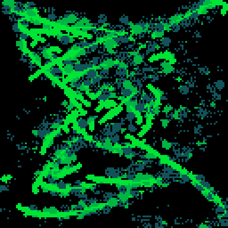

<h1>bad atom</h1>

</img>
</img>

[bad atom ipfs](https://cloudflare-ipfs.com/ipfs/QmRw2dtBcUJ4vENkhb4Q6pDWv7cdC8Kp9fD6L1gKcAKx2Y/)

``` Lua
-- bad atom
-- alexthescott
-- 9/23/21 10:27pm

-- ❎,🅾️ change to light burn
-- ⬅️⬆️➡️⬇️ keys cls() 

p={8,136,130,11,139,131,12,140,129}
pal(p,1)

-- new seed every day of the year
srand(31*stat(81)+stat(82))

function new_obj(r,col)
	obj={}
	obj.col=col
	obj.point={x=64,y=64}

	-- state
	obj.grow=true
	obj.need_new=false
	obj.kill=false
	
	-- color transition
	obj.life_span=r
	obj.timer=0
	
	-- radius, rad_goal (spawn)
	-- rad vel, acc
	obj.r=0
	obj.rg=r
	obj.rv=0.25
	obj.ra=0.1
	
	-- angle, angle span
	obj.a=rnd()
	obj.span=.175
	
	-- x,y flip on even odd day	
	obj.coin=stat(82)%2==0
	obj.var=1+rnd()
	
	obj.draw=function(self)
		local p=self.point
		local a1=self.a-self.span/2
		local a2=self.a+self.span/2
		
		-- an if statment in the for
		-- loop felt wrong... 😐
		-- x,y flip
		if self.coin==true then
			--get/set front circle stroke
			x=p.x+cos(a2/self.var)*self.r
			y=p.y+sin(a2)*self.r
			if self.grow==false then
				circ(x,y,2,0)
				circ(x,y,3,0)
			end
			--all points between span
			for at=a2,a1,-0.002 do
				x=p.x+cos(at/self.var)*self.r
				y=p.y+sin(at)*self.r
				-- taper tail
				if at<=self.a then
					circfill(x,y,0,self.col)
				else
					circfill(x,y,1,self.col)
				end
			end
		else
			-- same as comments above
			-- but x is reg, y is flip
			x=p.x+cos(a2)*self.r
			y=p.y+sin(a2/self.var)*self.r
			if self.grow==false then
				circ(x,y,2,0)
				circ(x,y,3,0)
			end
			for at=a2,a1,-0.002 do
				x=p.x+cos(at)*self.r
				y=p.y+sin(at/self.var)*self.r
				if at<=self.a then
					circfill(x,y,0,self.col)
				else
					circfill(x,y,1,self.col)
				end
			end
		end
	end
	
	obj.update=function(self)
		self.a+=0.01
		
		-- color reset from new_col
		if self.need_next==true 
			and self.timer>=0 then
				self.timer-=1
				if self.timer<=0 then
					self.col=self.next_col
					self.need_next=false
				end
		end
		
		-- lh? lol
		if self.grow==true and
			self.r<=self.rg then
				circ(64,64,self.r*2)
				circ(64,64,self.r*1.5)
				self.r+=0.005
				self.r*=1.05
				if self.r>=self.rg then
					self.grow=false
				end
		end
		
		-- death?! fly away
		if self.kill==true then
			self.r+=self.rv
			self.rv+=self.ra
		end
	end
	
	obj.new_col=function(self,new)
		self.next_col=new
		self.timer=self.life_span
		self.need_next=true
	end
	
	obj.destroy=function(self)
		-- rm if center falls off
		local p=self.point
		if self.coin then
			x=p.x+cos(self.a/self.var)*self.r
			y=p.y+sin(self.a)*self.r
			if x<=0 or x>=128 or 
				y<=0 or y>=128 then
					del(objs,self)
			end
		else
			x=p.x+cos(self.a)*self.r
			y=p.y+sin(self.a/self.var)*self.r
			if x<=0 or x>=128 or 
				y<=0 or y>=128 then
					del(objs,self)
			end
		end
	end
	
	return obj
end

function burn()
	for i=1,1200 do 
		x=rnd(128)\1
		y=rnd(128)\1
		pc=pget(x,y)
		if pc!=0 and pc%3!=0 then
			circfill(x,y,1,pc+1)
		else
			pset(x,y,0)
		end
	end
end

function big_burn()
	-- curious that the rnd()
	-- adds ~15% much cpu time!
	for i=1,1200 do 
		x=rnd(128)\1
		y=rnd(128)\1
		pc=pget(x,y)
		if pc!=0 and pc%3!=0 then
			if rnd()<0.25 then
				circfill(x,y,2,pc+1)
			else
				circfill(x,y,1,pc)
			end
		else
			pset(x-1,y,0)
			pset(x+1,y,0)
		end
	end
end

objs={}
fc=0
-- frames till color change
color_cyc=600
global_color=1+3*(rnd(3)\1)

for i=1,32 do
	add(objs,new_obj(i*2,global_color))
end

month=stat(81)
day=stat(82)

cls()
::♥::
if t()<2 then
	print("bad atom",48,59,global_color)
	print(month.."/"..day,55,65)
else
	if btn(4) or btn(5) then
		burn()
	elseif btn(0) or btn(1) or
		btn(2) or btn(3) then
			cls()
	else
		big_burn()
	end
	
	for obj in all(objs) do
		obj:draw()
		obj:update()
		obj:destroy()
	end
	
	fc+=1
	
	if fc%(color_cyc*6)!=0and
		fc%color_cyc==0 then
			global_color+=3
			global_color%=9	
			for obj in all(objs) do
				obj:new_col(global_color)
			end
	end
	
	if fc%(color_cyc*6)==0 then
		for obj in all(objs) do
			obj.kill=true
		end
	end
	
	-- spwan new set set
	-- after last cycle
	if fc%(color_cyc*6.25)==0 then
		global_color+=3
		global_color%=9
		for i=1,32 do
			add(objs,new_obj(i*2,global_color))
		end
		fc=0
	end
	
end
flip()
goto ♥
```