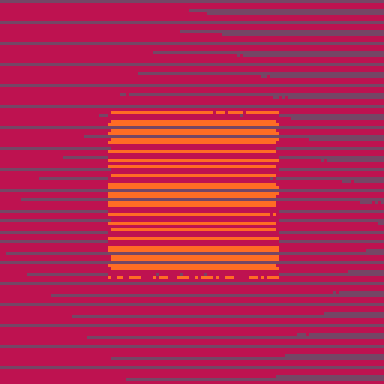

<h1>bad burnt pixel</h1>

</img>
</img>

[bad burnt pixel ipfs](https://cloudflare-ipfs.com/ipfs/QmQmveRB7CvELZYDihq1LuKLPmwjG7Bk3fDxtySW2s8eYE)

``` Lua
-- bad burnt pixel
-- alexthescott
-- 22/1/1

pal({130,141,136,137},1)s,c,r,a,k,m=sin,cos,rnd,abs,0,128 o1=2+r(8)
::♥::o=s(k)+s(k/2)o+=(o/2)*s(k/o1)o/=2n=((o+1)/2)
for i=0,m*15 do
x,y,v=r(m)\1,r(m)\1,1+n*3
if(y%3!=0and a(x-64)<n*64and a(y-64)<n*64)v+=1
if(s(x/(o1*m)+k/2)+c(y/(o1-.8)*m)<o/2)v+=1
pset(x,y,v)end 
k+=.0008
goto ♥
```