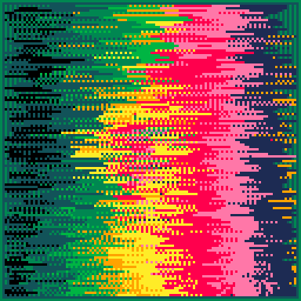

<h1>bad carwash</h1>

</img>
</img>

[bad carwash ipfs](https://gateway.fxhash2.xyz/ipfs/QmT1qoRmfQYBZT5moskGkWKS9xBhj65mpHB79UoWxKcvsx/?fxhash=oo2zCt3f6m3DcgLzmiYv4WJdbcTDJ9exVqsQtcJ1qmcgxfYTNKv)

``` Lua
-- bad carwash
-- alexthescott
-- 22/1/1

function center_vert_split(p)
	return abs(p.x-cx)<=rnd(cx*focus)
end

function center_hori_split(p)
	return abs(p.y-cy)<=rnd(cy*focus)
end

function center_square(p)
	return abs(p.x-cx)<cx*rnd() and abs(p.y-cy)<cy*rnd()
end

function forward()
	v=c[1]
	del(c,v)
	c[#c+1]=v
	pal(c,1)
end

s=rnd(-1)
srand(s)

p1={2,136,8,142,143,10,135,7}
p2={129,1,140,12,15,143,14,7}
p3={129,131,3,139,11,138,135,7}
p4={130,141,136,137,142,143,15,135}
p5={128,130,132,4,137,142,9,10}
p6={128,133,141,5,13,6,15,7}
p7={1,131,3,139,9,10,8,14}
p8={128,130,133,134,15,14,142,7}
 
p={p1,p2,p3,p4,p5,p6,p7,p8}
c=rnd(p)
pal(c,1)

for i=1,rnd(4) do
	forward()
end

swipe_dir=rnd(2)\1
v1=1+rnd(6)
v2=1+rnd(6)

paint_dir=(rnd(2)\1)==0
dir=((rnd(2)\1)*2)-1
version=rnd(3)\1

fps_boost=rnd(20)\1

cx=16+rnd(96)
cy=16+rnd(96)

focus=0.5+rnd(0.5)
defr=rnd(100)
push=rnd()

fc=0

cls()
_set_fps(60)
::♥::
fc+=1

for i=0,364 do
	p=0x6000+rnd(8128)\1
	if swipe_dir==0 then
		x=(fc/4)-64+rnd(32)\1
		y=rnd(128)\1
	else
		x=rnd(128)\1
		y=(fc/4)-32+rnd(20)\1
	end
	
	a=atan2(x-63,y-63)+push
	if paint_dir then
		v=(fc/96)%8
		if(v==0)v=1
	else
		v=(x/128)*8
	end
	pnt={x=x,y=y}
	if(center_vert_split(pnt))v+=0.5
	if(center_hori_split(pnt))v+=0.5
	--pset(x,y,v-1)
	pset(x+cos(a)*v*v2/2,y+sin(a)*v*v1/2,v+1)
	pset(x+sin(a)*v*v1,y+cos(a)*v*v2,v)
	if rnd()<0.5 then
		if version==0 then
			poke(p+64,peek(p))
			poke(p+dir,peek(p))
		elseif version==1 then
			poke(p+64,peek(p))
			poke(p-64,peek(p))
		else
			pv=peek(p)-0.5
			poke(p+dir,peek(p))
			poke(p-dir,peek(p))
		end
	end
end

if fc<=1024 then
	fc+=1
else
	fc=0
	srand(s)
end

rect(0,0,127,127,2)
rect(1,1,126,126,1)

flip()
goto ♥
```