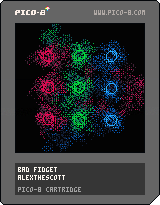

<h1>bad fidget</h1>

</img>
</img>

[bad fidget ipfs](https://cloudflare-ipfs.com/ipfs/QmeMwTaRaa9vgGNH9SghUicVWcN6oG1Z8SrJFpjdimHfzt/)

``` Lua
-- bad fidget
-- alexthescott
-- 9/9/21

p={8,136,130,11,139,131,12,140,129}
pal(p,1)

function new_clear()
	local clr={}
	clr.i=0
	
	clr.update=function(self)
		self.i+=1
	end
	
	clr.draw=function(self)
		circfill(64,64,self.i)
	end
	
	clr.destroy=function(self)
		if self.i>=91 then
			del(screen_wipe,self)
		end
	end
	
	add(screen_wipe,clr)
end

function new_cluster(a,col,row,state)
	c={}
	c.state=state
	-- row x pos
	c.row=row
	--timer
	c.t=0
	c.a=a
	c.c=col
	-- rotate radius
	c.r=44
	c.a_x=64+cos(c.a)*c.r
	c.a_y=64+sin(c.a)*c.r
	--point size
	c.ps=10
	c.p1={}
	c.p1.a=0
	c.p1.x=c.a_x+cos(c.p1.a)*c.ps
	c.p1.y=c.a_y+sin(c.p1.a)*c.ps
	c.p1.xg=c.a_x+cos(c.p1.a)*c.ps
	c.p1.yg=c.a_y+sin(c.p1.a)*c.ps
	c.p2={}
	c.p2.a=1/3
	c.p2.x=c.a_x+cos(c.p2.a)*c.ps
	c.p2.y=c.a_y+sin(c.p2.a)*c.ps
	c.p2.xg=c.a_x+cos(c.p2.a)*c.ps
	c.p2.yg=c.a_y+sin(c.p2.a)*c.ps
	c.p3={}
	c.p3.a=2/3
	c.p3.x=c.a_x+cos(c.p3.a)*c.ps
	c.p3.y=c.a_y+sin(c.p3.a)*c.ps
	c.p3.xg=c.a_x+cos(c.p3.a)*c.ps
	c.p3.yg=c.a_y+sin(c.p3.a)*c.ps
	
	c.draw=function(self)
		p1=self.p1
		p2=self.p2
		p3=self.p3
		circ(p1.x,p1.y,5,self.c)
		circ(p2.x,p2.y,5,self.c)
		circ(p3.x,p3.y,5,self.c)
	end
	
	c.update=function(self)
		if self.state=='rotate' then
			-- floor self.a
			-- floor self.p1.a & others
			self.a+=0.001
			
			if self.a>=1 then
				self.a=0
			end
			
			self.a_x=64+cos(self.a)*self.r
			self.a_y=64+sin(self.a)*self.r
			
			self.p1.a+=0.003
			self.p2.a+=0.003
			self.p3.a+=0.003
			
			if self.p1.a==0 then
				self.p1.a=0
			end
			if self.p2.a==0 then
				self.p2.a=0
			end
			if self.p3.a==0 then
				self.p3.a=0
			end
			
			self.p1.xg=self.a_x+cos(self.p1.a)*self.ps
			self.p1.yg=self.a_y+sin(self.p1.a)*self.ps
		
			p1_xd=(self.p1.xg-self.p1.x)/20
			p1_yd=(self.p1.yg-self.p1.y)/20
			self.p1.x+=p1_xd
			self.p1.y+=p1_yd
		
			self.p2.xg=self.a_x+cos(self.p2.a)*self.ps
			self.p2.yg=self.a_y+sin(self.p2.a)*self.ps
			
			p2_xd=(self.p2.xg-self.p2.x)/20
			p2_yd=(self.p2.yg-self.p2.y)/20
			self.p2.x+=p2_xd
			self.p2.y+=p2_yd
			
			self.p3.xg=self.a_x+cos(self.p3.a)*self.ps
			self.p3.yg=self.a_y+sin(self.p3.a)*self.ps
		
			p3_xd=(self.p3.xg-self.p3.x)/20
			p3_yd=(self.p3.yg-self.p3.y)/20
			self.p3.x+=p3_xd
			self.p3.y+=p3_yd
		else
			self.p1.xg=self.row
			self.p1.yg=32
			
			p1_xd=(self.p1.xg-self.p1.x)/10
			p1_yd=(self.p1.yg-self.p1.y)/10
			p1.x+=p1_xd
			p1.y+=p1_yd
			
			self.p2.xg=self.row
			self.p2.yg=64
			
			p2_xd=(self.p2.xg-self.p2.x)/10
			p2_yd=(self.p2.yg-self.p2.y)/10
			p2.x+=p2_xd
			p2.y+=p2_yd
			
			self.p3.xg=self.row
			self.p3.yg=96
			
			p3_xd=(self.p3.xg-self.p3.x)/10
			p3_yd=(self.p3.yg-self.p3.y)/10
			p3.x+=p3_xd
			p3.y+=p3_yd
		end
		
		self.t+=1
		
		if self.t==1200 then
			if self.state=='rotate' then
				self.row+=32
				if self.row>96 then
					self.row=32
				end
				self.state='grid'
			else
				self.state='rotate'
			end
			self.t=0
		end
	end
	
	c.debug=function(self)
		print(c.a_x,0,0,7)
		print(c.a_y,0,6,7)
	end
	
	add(clusters,c)
end

function burn()
	for i=1,600 do
		x=(rnd(64)\1)*2
		y=(rnd(64)\1)*2
		x=rnd(128)\1
		y=rnd(128)\1
		pc=pget(x,y)
		if pc%3!=0 then
			nc=rnd(2)\1
			pset(x,y,pc+1)
			pset(x,y-2,pc+nc)
			pset(x,y+2,pc+nc)
			pset(x-2,y,pc+nc)
			pset(x+2,y,pc+nc)
			
			if rnd(2)\1==0 and nc==1 then
				pset(x,y+1,pc+nc)
				pset(x,y-1,pc+nc)
				pset(x,y+3,pc+nc)
				pset(x,y-3,pc+nc)
			end
		end
		pset(x,y,0)
	end
end

screen_wipe={}
clusters={}
fc=0

if rnd(2)\1==0 then
	state='rotate'
else
	state='grid'
end
new_cluster(0,1,32,state)
new_cluster(1/3,4,64,state)
new_cluster(2/3,7,96,state)

cls()
::♥::
if t()<2 then
	print("bad fidget",44,64,4)
else
	burn()
	
	fc+=1
	if fc==500 then
		fc=0
	end
	
	for clr in all(screen_wipe) do
		clr:draw()
		clr:update()
		clr:destroy()
	end
	
	for c in all(clusters) do
		c:draw()
		c:update()
	end
end
flip()
goto ♥
```