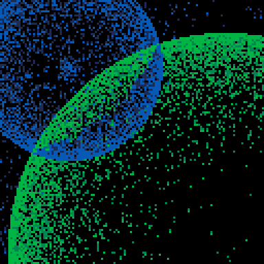

<h1>bad fireworks</h1>

</img>
</img>

[bad fireworks ipfs](https://cloudflare-ipfs.com/ipfs/QmYtr1M5Ub8FFR9CYbRiVcjqZhKxN28fUcBnkwyroM2QEW/)

``` Lua
-- bad fireworks
-- alexthescott
-- 8/24/21

p={1,140,2,136,3,139}
pal(p,1)

-- contrived oop
function add_splash()
	local b={}
	
	b.c=2+(rnd(3)\1)*2
	b.sr=0
	b.br=1
	b.bv=0.25
	b.bm=(1+rnd(4)\1)*3
	b.x=rnd(128)
	b.y=rnd(128)
	
	b.update=function(s)
		s.sr+=1
		if s.br>s.bm then
			s.bv=-0.25
		elseif s.br<=0 then
			s.bv=0
		end
		s.br+=s.bv
	end
	
	b.draw=function(s)
		circ(s.x,s.y,s.sr,b.c)
		if s.bv!=0 then
			circfill(s.x,s.y,s.br,b.c)
		end
	end
	
	b.destroy=function(s)
		if s.bv==0 and s.sr>181 then
			del(splash,s)
		end
	end
	
	add(splash,b)
end

-- set btn delay
poke(0x5f5d, 30)

splash={}
big_boom_count=0
add_splash()

cls()
::♥::

-- burn pixels
for p=0,2048 do
	px=rnd(128)
	py=rnd(128)
	pc=pget(px,py)
	if pc!=0 and pc%2==0 then
		if rnd(2)\1==0 then
			pset(px,py+1,pc)
		end
		pset(px,py,pc-1)
	else
		pset(px,py,0)
	end
end

-- little boom
if t()%2==0 then
	add_splash()
end

-- 20 sec 'big' boom
if t()%20==0 then
	big_boom_count=5
end

if big_boom_count>0 then
	if big_boom_count%1==0 then
		add_splash()
	end
	big_boom_count-=0.5
end

-- diy boom
if btnp(4) or btnp(5) then
	add_splash()
end

-- object loop
for s in all(splash) do
	s:draw()
	s:update()
	s:destroy()
end

flip()
goto ♥

```