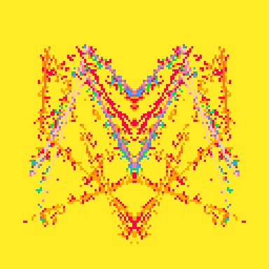
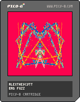

<h1>bad fuzz</h1>

</img>
</img>

Inspiration:

I had the chance to flip @carson's handoff piece, Sigil Squared. I knew I wanted to keep the same palette, line structure, and mirroring of some kind. I love how Sigil Squared pulses into different shapes before stopping, but I wanted to try to turn the animation into a slow and angular pixel lava lamp. By far the most difficult part was trying to squeeze every last character in the tweetcart. I had to make some sacrifices with the pixel burning effect around the lines, but ended with a trig offset that I quite liked. 

If you're interested, the Tweetcart Relay is a series of tweetcarts minted and passed between artists who take the prior work, and modify it to their liking. Anyone who likes to make tweetcarts or wants to learn how can join!

Relay information:
-> inspiration tweetcart: Dither Gang Relay; https://www.fxhash.xyz/generative/slug/sigil-squared
-> inspiration tweetcart author: carson; tz1XqJ9e6NdouxdGvm2V3aknwFnGL6Kinu6A
-> destination tweetcart author: aebrer; tz1ZBMhTa7gxSpaeXoqyc6bTCrxEHfZYSpPt

Pico-8 Source Code:
-> 149 Tokens, 270 Characters

``` Lua
-- alexthescott
-- bad fuzz
-- 22/12/16

-- fxhash()
rng = stat(6)
if rng == "" then
rng=tostr(rnd(-1)\1)..","..tostr(1+rnd(3)\1)..","..tostr(rnd(16)\1)..","
end
rng_vals = {}
c_num = ""
for i=1,#rng do
 if sub(rng,i,i) != "," then
  c_num = c_num..sub(rng,i,i)
 else 
  add(rng_vals,tonum(c_num))
  c_num = ""
 end
end

--tweetcart
poke(24364,5)r=rnd
z=r(.0004)p=.5+r(2)+5e=r(9)+1g=8f=128n=cos
for i=0,7do pal(i,(r{8,-7,9,10,11,12,140}),1)end::♥::g+=z
for i=0,768do
x=r(f)y=r(f)pset(x-n(x),y-n(y),max(pget(x,y)-1,0))end
for i=0,32do
m=(p+n(g))*7
line(n(n(g/p-i/32))*m+64,n(n(g/7-i/7))*m+64,i)end
goto ♥
```