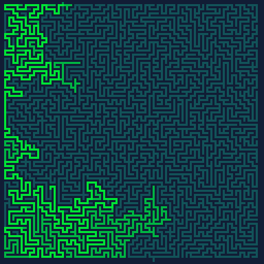
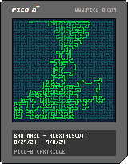

<h1>bad maze</h1>

</img>
</img>

``` Lua
-- bad maze - alexthescott
-- 8/29/24 - 9/8/24

-- bad fire
p1={[0]=2,136,8,142,143,10,135,7}
-- bad matrix green
p2={[0]=129,131,3,139,11,138,135,7}
-- bad magma
p3={[0]=130,141,136,137,142,143,15,135}
-- bad october
p4={[0]=128,130,132,4,137,142,9,10}
-- bad thermal
p5={[0]=1,131,3,139,9,10,8,14}
-- bad jawbreaker
p6={[0]=128,130,133,134,15,14,142,7}
-- bad sulfur
p7={[0]=130,136,8,137,13,140,12,7}

p={p1,p2,p3,p4,p5,p6,p7}
pal(rnd(p),1)

function draw_grid()
	for x=0,128,2 do
	 for y=0,128,2 do
	 	pset(x,y,2)
	 end
	end
end

function draw_boarder()
	--top
	line(0,0,128,0,0)
	--right
	line(127,0,127,127,0)
	line(126,0,126,126,0)
	--bottom
	line(127,127,0,127,0)
	line(126,126,0,126,0)
	--left
	line(0,0,0,128,0)
end

function copy_table(t)
 n={}
	for k,v in pairs(t) do
	  n[k]=v
	end
	return n
end

function check_neigh(p, v, d)
	--given pos p, check
	--up right down left for unseen
	--up:0, right:1, down:2, left:3
	n={}

	--up
	if pget(p[1],p[2]+d) == v then
		add(n, {p[1],p[2]+d})
	end
	
	-- right
	if pget(p[1]+d,p[2]) == v then
			add(n, {p[1]+d,p[2]})
	end
	
	-- down
	if pget(p[1],p[2]-d) == v then
				add(n, {p[1],p[2]-d})
	end
	
	-- left
	if pget(p[1]-d,p[2]) == v then
				add(n, {p[1]-d,p[2]})
	end

	return n
end

-- https://www.lexaloffle.com/bbs/?tid=3389
function pop(stack)
    local v = stack[#stack]
    stack[#stack]=nil
    return v
end

function get_build_start_pos()
	start_pos = rnd()
	n_pos={}
	if start_pos <= 0.25 then
		n_pos={2*flr(rnd(63)),2}
	elseif start_pos <= 0.5 then
		n_pos={124,2*flr(rnd(63))}
	elseif start_pos <=0.74 then
		n_pos={2*flr(rnd(63)),124}
	else
		n_pos={2,2*flr(rnd(63))}
	end
	return n_pos
end

reset_clock = 0
seen_nghbor={}
c_pos = get_build_start_pos()
decay=rnd()<0.5
build_maze=true
solve_maze=false
next_step=true


cls(0)
_set_fps(60)

draw_grid()
draw_boarder()
::_::


-- build the maze
while build_maze do
	neigh = check_neigh(c_pos, 2, 2)
	if #neigh >= 1 then
		c_neigh=rnd(neigh)
		if #neigh > 1 then
			add(seen_nghbor, copy_table(c_pos))
		end
	elseif #neigh == 0 then
		for i = #seen_nghbor, 1, -1 do
		 new_pos = seen_nghbor[i]
			neigh = check_neigh(new_pos, 2, 2)
			if #neigh == 0 then
				del(seen_nghbor,seen_nghbor[i])
			else
				c_neigh = rnd(neigh)
				c_pos = copy_table(new_pos)
				--not harmful lol
				goto ♥ 
			end
		end
	end
	::♥::
	line(c_pos[1],c_pos[2],c_neigh[1],c_neigh[2],1)
	c_pos=copy_table(c_neigh)
	-- speed-up option
	if (not btn(❎) and not btn(🅾️)) then
		flip()
	end
	if #neigh == 0 and #seen_nghbor == 0 then
			solve_maze=true
			build_maze=false
			solve_start = {2+2*flr(rnd(60)),2}
			solve_end = {2+2*flr(rnd(60)),124}
			pset(solve_start[1],solve_start[2]-1,2)
			pset(solve_end[1],solve_end[2]+1,1)
			pset(solve_end[1],solve_end[2]+2,1)
	end
end

if (btnp(❎) or btnp(🅾️)) or (btn(❎) and btn(🅾️)) then
	next_step=true
end

--solve the maze
while not build_maze and solve_maze and next_step do
	next_step=true
	s_o_neighbor=nil
	o_neighbor=nil

	--printh("solve_start: ["..solve_start[1]..", "..solve_start[2].."]")

	neigh = check_neigh(solve_start, 1, 1)
	if #neigh > 0 then
		add(seen_nghbor, copy_table(solve_start))
			c_neigh=rnd(neigh)
	else
		c_neigh = nil
		for i = #seen_nghbor, 1, -1 do
			o_neighbor = seen_nghbor[i]
			line(solve_start[1],solve_start[2],o_neighbor[1],o_neighbor[2],3)
			if not btn(❎) and not btn(🅾️) then
				flip()
			end
			s_o_neighbor=copy_table(solve_start)
			solve_start = copy_table(o_neighbor)
			neigh = check_neigh(solve_start, 1, 1)
			if #neigh > 0 then
				c_neigh = rnd(neigh)
				goto 웃 --not harmful lol
			end
			del(seen_nghbor,seen_nghbor[i])
		end
	end
	::웃::
	if c_neigh != nil then
		line(solve_start[1],solve_start[2],c_neigh[1],c_neigh[2],4)
		solve_start=copy_table(c_neigh)
	end

	-- check end
	if solve_start[1]==solve_end[1] and
		solve_start[2]==solve_end[2] then
			pset(solve_end[1],solve_end[2],4)
			pset(solve_end[1],solve_end[2]+1,4)
			pset(solve_end[1],solve_end[2]+2,4)

			solve_maze=false
	end
	if decay and rnd()<0.5 then
		for i=0,1do x,y=rnd(128),rnd(128)c=pget(x,y)if(c>1)pset(x,y,c-1)end
	end
	if not btn(❎) and not btn(🅾️) then
		flip()
	end
end

if reset_clock >= 180 then
				pal(rnd(p),1)
				reset_clock = 0
				seen_nghbor={}
				c_pos = get_build_start_pos()
				build_maze=true
				solve_maze=false
				decay=rnd()<0.5
				cls(0)
				draw_grid()
				draw_boarder()
elseif not solve_maze and not build_maze then
		reset_clock+=1
end

flip()

goto _
```