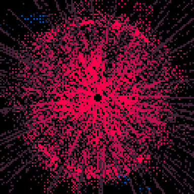

<h1>bad portal</h1>

</img>
</img>

[bad portal ipfs](https://cloudflare-ipfs.com/ipfs/QmS7z9icTVhZDMZHsmQp5DGRcCs4eMJ1hxyitnjJLT3T5d/)

``` Lua
-- bad portal
-- alexthescott
-- 9/8/20

p={8,136,130,11,139,131,12,140,129}
pal(p,1)

function dist(x1,y1,x2,y2)
	return sqrt((x1-x2)^2+(y1-y2)^2)
end

function new_particle(c)
	p={}
	p.x=64
	p.y=64
	p.xt=64
	p.yt=64
	p.a=rnd(1)
	p.oc=c
	p.c=c
	p.dx=cos(p.a)/3
	p.dy=sin(p.a)/3
	
	p.update=function(self)
		self.x+=self.dx
		self.y+=self.dy
		
		self.xt+=self.dx*0.8
		self.yt+=self.dy*0.8
		
		self.dx*=1.05
		self.dy*=1.05
		
		d=dist(self.x,self.y,64,64)
		
		if d>52 then
			self.c=self.oc+2
		elseif d>=32 then
			self.c=self.oc+1
		end 
	end
	
	p.draw=function(self)
		line(self.x,self.y,self.xt,self.yt,self.c)
	end
	
	p.destroy=function(self)
		return self.xt<=0 or self.xt>=128 or
			self.yt<=0 or self.yt>=128
	end
	
	p.debug=function(self)
		rectfill(0,0,10,10,0)
		print(self.d,0,0,7)
	end
	
	return p
end

function new_orbit(c)
	o={}
	o.s=1
	o.show=90+rnd(20)\1
	o.r=100
	o.a=rnd(1)
	o.ac=rnd(1)
	o.av=0.005
	o.c=c
	o.x=64+cos(o.a)*o.r/2
	o.y=64+sin(o.a)*o.r/2
	
	o.update=function(self)
		self.a+=sin(self.ac)/200
		self.ac+=self.av
		
		if self.ac>=1 then
			self.tc=0
		end
		
		self.x=64+cos(self.a)*self.r/2
		self.y=64+sin(self.a)*self.r/2
	end
	
	o.draw=function(self)
		circfill(self.x,self.y,self.s,self.c)
	end
	
	o.new_c=function(self,c)
		self.c=c
	end
	
	return o
end

function burn()
	for i=1,1200 do
		x=rnd(128)\1
		y=rnd(128)\1
		pc=pget(x,y)
		if pc%3!=0 then
			nc=rnd(2)\1
			pset(x,y,pc+nc)
			pset(x,y-2,pc+nc)
			pset(x,y+2,pc+nc)
			pset(x-2,y,pc+nc)
			pset(x+2,y,pc+nc)
		end
		pset(x,y,0)
	end
end

global_color=7
fc=0

particles={}

orbits={}
for i=1,10 do
	add(orbits,new_orbit(global_color))
end

-- expanding lines, expanding circle
ring_r=50
border_r=10

cls()
::♥::
if t()<2 then
	print("bad portal",44,64,7)
else
	burn()
	
	if fc>=2000 then
		fc=0
	end
	
	fc+=1
	
	if fc%2==0 then
		for i=1,8 do
			add(particles,new_particle(global_color))
		end
	end
	
	if fc%500==0 then
		global_color+=3
		global_color%=9
		for o in all(orbits) do
			o:new_c(global_color)
		end
	end
	
	for p in all(particles) do
		p:update()
		p:draw()
		if p:destroy() then
			del(particles,p)
		end
	end
	
	for o in all(orbits) do
		o:update()
		if fc%o.show<=80 then
			o:draw()
		end
	end
	
	if fc%500>400 and fc%500<425 then
		circ(64,64,ring_r,global_color)
		ring_r+=0.25
	else
		ring_r=50
	end
	
	if fc%500>300 and fc%500<350 then
		-- top left
		line(4,4,4+border_r,4)
		line(4,4,4,4+border_r)
		
		-- top right
		line(124,4,124-border_r,4)
		line(124,4,124,4+border_r)
		
		-- bottom right
		line(124,124,124-border_r,124)
		line(124,124,124,124-border_r)
			
		-- bottom left
		line(4,124,4+border_r,124)
		line(4,124,4,124-border_r)
		
		border_r+=0.75
	else
		border_r=10
	end
	
	circfill(64,64,2,0)
end
flip()
goto ♥
```