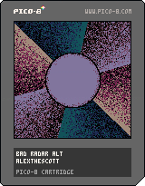

<h1>bad radar alt</h1>

</img>
</img>

[bad radar alt ipfs]()

``` Lua
-- bad radar alt
-- alexthescott
-- 8/23/21

circ_c=1
t=0
v=-0.001
p={134,2,130,13,141,128,131,1,129}
pal(p,1)
cls()
::♥::
if time()<2 then
	print("bad radar alt",38,64,1)
else
	--burn pixels
	for c=0, 256 do 
		local x=rnd(128)
		local y=rnd(128)
		local f=pget(x,y)
		if f%3>0 then
	 	pset(x,y,f+1)
	 else
	 	pset(x,y,0)
	 end
	end
	
	-- draw 6 lines
	for i=1,6do
		x=33+((cos(t+i/6)+1)/2)*63
		y=33+((sin(t+i/6)+1)/2)*63
		x2=-32+((cos(t+i/6)+1)/2)*192
		y2=-32+((sin(t+i/6)+1)/2)*192
		line(x,y,x2,y2,(1+(i-1)*3)%9)
	end
	
	-- invert v
	if btnp(4) or btnp(5) then
		v*=-1
	end
	
	t+=v
	
	if t==abs(1)then
		t=0
	end
	
	-- draw inner circle
	s=(cos(0.375+time()/16)+1)/2
	
	if s==0 then
		circ_c+=3
		circ_c%=9
	end
	
	circfill(64,64,29*s,circ_c)
end
flip()
goto ♥

```