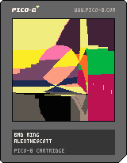

<h1>bad ring</h1>

</img>
</img>

Inspiration:

P1x3lboy's handoff piece, Dither Gang Relay, utilized lots of fast screen -> sprite calls to add chaos to a series of lines, which start on the left, make their way to the right, and back off the screen to the left. I loved how slow the lines were moving, and wanted to tune down the pace of the piece unto somehting far more constrained, and with slower sprite calls. The movement is both symetic, and broken. Our ring here is never quite a complete idea, as we shift screen contents slowly from the center to the edges. 

Tweetcart Relay is a series of tweetcarts minted and passed between artists who take the prior work, and modify it to their liking. Anyone who likes to make tweetcarts or wants to learn how can join!

Relay information:
-> inspiration tweetcart: Dither Gang Relay; https://www.fxhash.xyz/generative/16831
-> inspiration tweetcart author: p1x3lboy; tz1SvJbECAva9gxczfBmX3CAFUszgQXNgsNm
-> destination tweetcart author: aebrer; tz1ZBMhTa7gxSpaeXoqyc6bTCrxEHfZYSpPt

Pico-8 Source Code:
-> 155 Tokens, 280 Characters

``` Lua
-- bad ring
-- alexthescott
-- 22/9/30

-- fxhash()
rng = stat(6)
if rng == "" then
rng=tostr(rnd(-1)\1)..","..tostr(1+rnd(3)\1)..","..tostr(rnd(16)\1)..","
end
rng_vals = {}
c_num = ""
for i=1,#rng do
 if sub(rng,i,i) != "," then
  c_num = c_num..sub(rng,i,i)
 else 
  add(rng_vals,tonum(c_num))
  c_num = ""
 end
end
srand(rng_vals[1])

-- tweetcart
cls()
r=rnd
p=srand
q=poke
n=cos
f=0g=r()v=128s=r(-1)p(s)c=r(9)%1+4
q(0x5f54,0x60)
for i=0,16 do pal (i,(r(33)-17),1)end
::_::
flip()b=(g%9)/2g+=r(.01)
for i=0,v do
m=1+n(g/v)\2
line(64+n(n(g/8-i/v))*32*m,64+n(n(g/v-i/v))*32*m,i/4)
end
if(r()>.001)sspr(1,1,v-2,v-2,0,0,v,v)
goto _
```