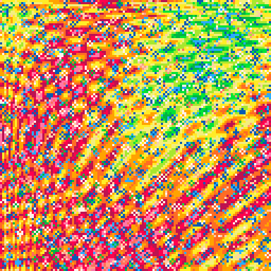
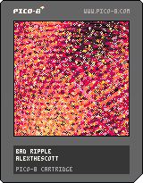

<h1>bad ripple</h1>

</img>
</img>

Two ripples on top of gentle sin gradients run into each other forever, growing and shrinking to create a distorted lattice. Of three possible palettes, 12 of the 16 colors are chosen at runtime.

``` Lua
-- bad ripple
-- alexthescott
-- 22/4/18

-- ty to @aebrer for this maths
rng = stat(6)
if rng == "" then
rng=tostr(rnd(-1)\1)..","..tostr(1+rnd(3)\1)..","..tostr(1+rnd(15)\1)..","..tostr(rnd())..","..tostr(rnd(15)\1)..","..tostr(rnd(15)\1)..","..tostr(rnd(5)\1)
end
rng_vals = {}
c_num = ""
for i=1,#rng do
 if sub(rng,i,i) != "," then
  c_num = c_num..sub(rng,i,i)
 else 
  add(rng_vals,tonum(c_num))
  c_num = ""
 end
end

srand(rng_vals[1])

-- bad weather map
p1={7,6,135,10,138,11,139,3,131,12,140,1,129,130,128,0}
-- bad heat
p2={7,135,10,9,15,143,142,137,14,136,8,2,130,133,128,0}
-- bad tropic
p3={7,15,143,142,14,8,136,137,9,10,135,138,11,139,12,140}

p={p1,p2,p3}
c=p[rng_vals[2]]
pal(c,1)

function forward()
	v=c[1]
	del(c,v)
	c[#c+1]=v
	pal(c,1)
end

for i=1,rng_vals[3] do
	forward()
end

t=rng_vals[4]
f=0

v1=4+rng_vals[5]
v2=4+rng_vals[6]
vd=rng_vals[7]

cls(6)
_set_fps(60)
::♥::

for i=0,380 do
	x=rnd(128)\1
	y=rnd(128)\1
	s=4*sin(t/3)
	v=(sin(x/128)+
		cos(y/256)+
		cos(t/(x+y)/280)+
		sin(t+(x+y)/128)+
		sin(-t+s+sqrt((x/v1-16+v1)^2+(y/v2-16+v2)^2)))+
		sin(-t+s+sqrt(x*y+y*x)/8)
	pset(x,y,(6+v)/.75)
end

for d=0,32 do
	x=rnd(128)
	y=rnd(128)
	a=atan2((64-x)/128,(64-y)/128)
	x2=x-cos(a)
	y2=y-sin(a)
	if vd==0 then
		v=pget(x,y)
	elseif vd==1 then
		v=pget(x-1,y)
	elseif vd==2 then
		v=pget(x+1,y)
	elseif vd==3 then
		v=pget(x,y+1)
	elseif vd==4 then
		v=pget(x,y-1)
	end
	circ(x,y,1,v)
end

t+=0.001

if f>=128 then
	if f>=130 then
		f=0
	else
		srand(1)
	end
end

f+=1

flip()
goto ♥
```