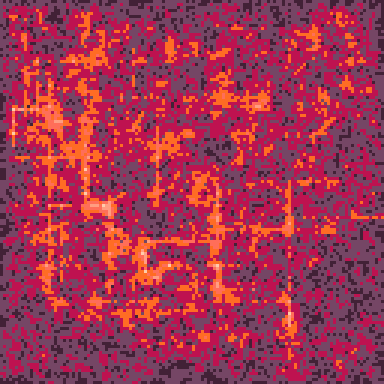
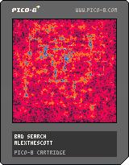

<h1>bad search</h1>

</img>
</img>

Every day a random grid is grown and traversed with 7 ants. As the ants move from node to node, hot spots grow and shrink with along a sine wave.

``` Lua
-- bad search
-- alexthescott
-- 22/6/18

-- ty to @aebrer for this maths
rng = stat(6)
if rng == "" then
rng=tostr(rnd(-1)\1)..","..tostr(1+rnd(7)\1)..","
end
rng_vals = {}
c_num = ""
for i=1,#rng do
 if sub(rng,i,i) != "," then
  c_num = c_num..sub(rng,i,i)
 else 
  add(rng_vals,tonum(c_num))
  c_num = ""
 end
end

srand(rng_vals[1])

function copy(t)
	local c = {}
	for k,v in pairs(t) do
		c[k]=v
	end
	return c
end

function hueristic(a,b)
 return abs(a[1]-b[1])+abs(a[2]-b[2])
end

function vectoindex(vec)
	i=((1+vec[1])*128)+vec[2]
	return i
end

function indextovec(index)
	local x=(index-1)/128
	local y=i-x*128
	return {x,y}
end

function shuffle(t)
  -- fisher-yates type beat
  for i=#t,1,-1 do
    j=flr(rnd(i)) + 1
    t[i],t[j]=t[j],t[i]
  end
  return t
end

-- insert into table and sort by priority
function insert(t,val,p)
 if #t>=1 then
  add(t,{})
  for i=(#t),2,-1 do
   local next=t[i-1]
   if p<next[2] then
    t[i]={val,p}
    return
   else
    t[i]=next
   end
  end
  t[1]={val,p}
 else
  add(t,{val,p}) 
 end
end

-- pop the last element off a table
function popend(t)
 local top = t[#t]
 del(t,t[#t])
 return top[1]
end

function reverse(t)
 for i=1,(#t/2) do
  local temp = t[i]
  local oppindex = #t-(i-1)
  t[i] = t[oppindex]
  t[oppindex] = temp
 end
end

function getneighbours(pos)
 local n={}
 local x=pos[1]
 local y=pos[2]
 
 if sget(x,y-1)!=0 then
 	ty=y-2
 	while sget(x,ty)!=2 do
 		ty-=1
 		if ty<=-8 then
 			stop("ty"..ty)
 		end
 	end
 	add(n,{x,ty})
 end
 
 if sget(x,y+1)!=0 then
 	ty=y+2
 	while sget(x,ty)!=2 do
 		ty+=1
 		if ty>=130 then
 			stop("x:"..x.." ty"..ty)
 		end
 	end
 	add(n,{x,ty})
 end
 
 if sget(x-1,y)!=0 then
 	tx=x-2
 	while sget(tx,y)!=2 do
 		tx-=1
 		if tx<=-8 then
 			stop("tx:"..tx.." y"..y)
 		end
 	end
 	add(n,{tx,y})
 end
 
 if sget(x+1,y)!=0 then
 	tx=x+2
 	while sget(tx,y)!=2 do
 		tx+=1
 		if tx>=130 then
 			stop("tx:"..tx.." y"..y)
 		end
 	end
 	add(n,{tx,y})
 end

 return n
end

function new_line(x,y,d,c,b)
	if x<=0 or x>=127 or y<=0 or y>=127 then
		return
	end
	l={}
	l.p={x,y}
	l.d=d
	l.a=(1+rnd(3)\1)*4
	l.c=c
	l.b=b
	
	l.lol=function(s)
		x,y=s.p[1],s.p[2]
		pset(x,y,s.c)
		sset(x,y,s.c)
		dx=0
		dy=0
		
		if s.a<=0 then
			cnst=shuffle({0,1,2,3})
			if s.d==0 then
				od=2
			elseif s.d==1 then
				od=3
			elseif s.d==2 then
				od=0
			elseif s.d==3 then
				od=2
			end
			if rnd()<20/(#lines-1) or s.b then
				for i in all(cnst) do
					if i!=od then
						add(lines,new_line(x,y,i,lc,false))
					end
				end
			elseif rnd()<0.50 then
				for i in all(cnst) do
					if i!=od then
						add(lines,new_line(x,y,i,lc,false))
						goto _
					end
				end
			end
			::_::
			del(lines,s)
			return true
		end
		
		if s.d==0 then
			dy-=1
		elseif s.d==1 then
			dx+=1
		elseif s.d==2 then
			dy+=1
		elseif s.d==3 then
			dx-=1
		end
		
		if pget(x+dx,y+dy)!=0 then
			del(lines,s)
		end
		
		s.p[1]+=dx
		s.p[2]+=dy
		s.a-=1
	end
	return l
end

function get_nodes()
		for x=0,128,2 do
			for y=0,128,2 do
				get_node(x,y)
			end
		end
		
		for x=0,128,2 do
			get_node(x,127)
		end
		
		for y=0,128,2 do
			get_node(127,y)
		end
end

function get_node(x,y)
	u=pget(x,y-1)!=0
	d=pget(x,y+1)!=0
	l=pget(x-1,y)!=0
	r=pget(x+1,y)!=0
	ju=u and not d and not l and not r
	jd=d and not u and not l and not r
	jl=l and not u and not d and not r
	jr=r and not u and not d and not l
	
	if u and l or l and d or
				d and r or r and u or 
				ju or jd or jl or jr then
					add(nodes,{x,y})
					--pset(x,y,2)
					sset(x,y,2)
	end
end

function new_obj()
	o={}
	o.cg={0,0}
	o.c=false

	o.new_goal=function(self,birth)
		if birth==false then
			s=rnd(nodes)
		else
			s=birth
		end
		g=rnd(nodes)
		while s==g do g=rnd(nodes) end
		frontier={}
		insert(frontier,s,0)
		came_from={}
		came_from[vectoindex(s)]=nil
		cost_so_far={}
		cost_so_far[vectoindex(s)]=0
		
		-- find path
		while (#frontier>0) do
			cur=popend(frontier)
			if(vectoindex(cur)==vectoindex(g))break
			local neigh=getneighbours(cur)
			for n in all(neigh) do
				local next_i=vectoindex(n)
				local new_c=cost_so_far[vectoindex(cur)]+1
				if(cost_so_far[next_i]==nil)or(new_c<cost_so_far[next_i]) then
					cost_so_far[next_i]=new_c
					local p=new_c+hueristic(g,n)
					insert(frontier,n,p)
					came_from[next_i]=cur
				end
			end
		end

		current=came_from[vectoindex(g)]
		path={}
		ci,si=vectoindex(cur),vectoindex(s)
		while ci!=si do
			add(path,cur)
			cur=came_from[ci]
			ci=vectoindex(cur)
		end
		reverse(path)
		self.path=copy(path)
	end
		
	o.draw=function(self)
		if self.c==false or self.cg[1]==nil then
			if self.c==false then
				self:new_goal(self.c)
			else
				self:new_goal(self.p)
			end
			self.i=1
			self.c=copy(self.path[self.i])
			self.cg=copy(self.path[self.i+1])
		elseif self.c[1]!=self.cg[1] or self.c[2]!=self.cg[2] then
			if self.c[2]>self.cg[2] then
				self.c[2]-=1
			elseif self.c[1]<self.cg[1] then
				self.c[1]+=1
			elseif self.c[2]<self.cg[2] then
				self.c[2]+=1
			elseif self.c[1]>self.cg[1] then
				self.c[1]-=1
			end
		else
			self.p=copy(self.path[self.i])
			self.i=self.i+1
			--self.p=copy(self.c)
			self.c=copy(self.path[self.i])
			self.cg=copy(self.path[self.i+1])
		end
		local c = pget(self.c[1],self.c[2])+1
		if (c > 7) c = 1
		pset(self.c[1],self.c[2],c)
	end
	
	return o
end

function vote(push)
	-- vote decides pixel's val
	-- based on neighbors
	-- :param: push forces pos vote
	x,y=rnd(128)\1,rnd(128)\1
	
	pu=pget(x,y-1)
	pr=pget(x+1,y)
	pd=pget(x,y+1)
	pl=pget(x-1,y)
	pc=pget(x,y)
	
	pa=push+(pu+pr+pd+pl+pc)/5
	pa%=8
	pset(x,y,pa)
end

function burn()
	for q=0,256 do
		vote((1.4+sin(fc/300))/8-.051+rnd())
	end
	for r=0,32 do
		x=rnd(128)\1
		y=rnd(128)\1
		pset(x,y,max(pget(x,y)-1,0))
	end
end

-- bad fire
p1={[0]=2,136,8,142,143,10,135,7}
-- bad matrix green
p2={[0]=129,131,3,139,11,138,135,7}
-- bad magma
p3={[0]=130,141,136,137,142,143,15,135}
-- bad october
p4={[0]=128,130,132,4,137,142,9,10}
-- bad thermal
p5={[0]=1,131,3,139,9,10,8,14}
-- bad jawbreaker
p6={[0]=128,130,133,134,15,14,142,7}
-- bad sulfur
p7={[0]=130,136,8,137,13,140,12,7}

p={p1,p2,p3,p4,p5,p6,p7}
c=p[rng_vals[2]]
pal(c,1)

fc=0
lines={}
nodes={}
objs={}
start_nodes=false
lc=1
month=stat(81)
day=stat(82)

for i=0,3 do
	add(lines,new_line(64,64,i,1,true))
end

srand(31*stat(81)+stat(82))
cls()
_set_fps(60)
::♥::
if t()<2 then
	print("bad search",44,59,1)
	print(month.."/"..day,55,65,1)
elseif t()==2 then
	cls()
else
	for l in all(lines) do
		l:lol()
	end
	if #lines==0 then
		_set_fps(30)
		if start_nodes==false then
			get_nodes()
			start_nodes=true
			for i=1,7 do
				obj=new_obj()
				obj:new_goal(false)
				add(objs,obj)
			end
		else
			for o in all(objs) do
				o:draw()
			end
			burn()
		end
	else
	 
	end
	fc+=1
	if btn(❎) then
		-- no flip!
	else
		flip()
	end
end
goto ♥
```