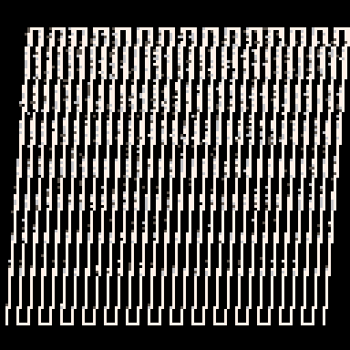

<h1>bad slant</h1>

</img>
</img>

[bad slant ipfs](https://cloudflare-ipfs.com/ipfs/QmQUwndEQNri4sdssE5o56L8eVsZqCxgjii2PhPADai7Ro/)

``` Lua
-- bad slant
-- alexthescott
-- 12/7/21 1:01pm

pal({5,6,7},1)
a,b,c,d,o,t,e,l=8,2,10,118,0,0,128,line
::♥::
for i=0,999 do
x,y=rnd(e),rnd(e)
pset(x,y,max(pget(x,y)-1,0))
end
for i=0,29 do
v=i*4 q=a+v+o l(a+o,c,b,d,3)l(q,c,b+v,d)
if i%2==0 then l(q,c,q+3,c)elseif i!=29then;l(b+v,d,b+v+3,d)end
end
o=sin(t)*4t+=.0008
flip()goto ♥
```