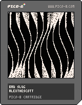

<h1>bad slug</h1>

</img>
</img>

``` Lua
-- bad slug
-- alexthescott
-- 22/6/15

?"\^!5f10057"
t=0m=128q=memcpy
cls()_set_fps(60)::♥::
for c=0,512do x,y=rnd(m),rnd(m)pset(x,y,max(pget(x,y)-1,0))end
for i=0,11do
for p=1,m do
v=sin(i/9+p/m+t)*9a,b=i*12+v,p-1c,d=i*12+v,p
line(a,b,c,d,2)end
end
flip()q(24576,24640,2048)q(30720,30656,2048)
t-=.0002
goto ♥
```