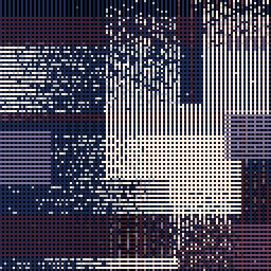
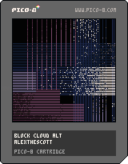

<h1>block cloud alt</h1>

</img>
</img>

[block cloud alt ipfs](https://cloudflare-ipfs.com/ipfs/QmXxWaXMUtbmJQdhhb6RXg5CPi9p6ApFGwJoL4gU7Rq82d/)

``` Lua
-- block cloud alt
-- alexthescott
-- 8/19/21

p={7,6,1,13,5,129,141,133,130}
pal(p,1)

function new_vert()
	local v={}
	v.w=10*(2+rnd(2))\1
	v.h=10*(2+rnd(2))\1
	v.x=rnd(127)\1
	v.c=rnd(3)\1
	v.f=rnd(2)\1
	if v.f==0 then
		v.y=0-v.h
	else
		v.y=127+v.h
	end
	
	v.draw=function(s)
		for x=s.x, s.x+s.w do
				if x%(2+v.c*2)==0 then
					if v.c==0then
						c=1
					elseif v.c==1then
						c=4
					else
						c=7
					end
			 	line(x,s.y,x,s.y+s.h,c)
				end
		end
	end
	
	v.update=function(s)
		if s.f==0 then
			s.y+=1
		else
			s.y-=1
		end
	end
	
	return v
end

function new_hori()
	local h={}
	h.w=10*(2+rnd(2))\1
	h.h=10*(2+rnd(2))\1
	h.y=rnd(127)\1
	h.c=rnd(3)\1
	h.f=rnd(2)\1
	if h.f==0 then
		h.x=0-h.w
	else
		h.x=127+h.w
	end
	
	h.draw=function(s)
		for y=s.y, s.y+s.h do
				if y%2==0 then
					if h.c==0then
						c=1
					elseif h.c==1then
						c=4
					else
						c=7
					end
			 	line(s.x,y,s.x+s.w,y,c)
				end
		end
	end
	
	h.update=function(s)
		if s.f==0 then
			s.x+=1
		else
			s.x-=1
		end
	end
	
	return h
end

function new_clear()
	local clr={}
	clr.i=1
	
	clr.update=function(s)
		s.i+=1
	end
	
	clr.draw=function(s)
		line(s.i,0,0,s.i,0)
		line(256-s.i,0,0,256-s.i,0)
	end
	
	clr.destroy=function(s)
		return s.i>=256
	end
	
	return clr
end

swipe={}
blob={}
add(blob,new_vert())
add(blob,new_hori())

timer=0.03125

cls(0)
::♥::
if t()<2 then
	print("block cloud alt",34,64,1)
else
	--burn pixels
	for c=0, 1024 do 
		local x=rnd(128)
		local y=rnd(128)
		local f=pget(x,y)
		if f%3>0 then
	 	pset(x,y,f+1)
	 end
	end
	
	if t()%60==0or btn(5) or btn(4) then
		add(swipe,new_clear())
	end
	
	for clr in all(swipe) do
		clr:draw()
		clr:update()
		if clr:destroy() then
			del(swipe,clr)
		end
	end
	
	for b in all(blob) do
		b:draw()
		b:update()
		if b.f==0 then
			if b.x>=128 or b.y>=128 then
				del(blob,b)
			end
		else
			if b.x<=0-b.w or b.y<=0-b.h then
				del(blob,b)
			end
		end
	end
	
	if time()%timer==0 then
		add(blob,new_hori())
		add(blob,new_vert())
		timer=(1+rnd(2))\1
	end
end
flip()
goto ♥
```