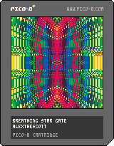

<h1>breathing star gate</h1>

</img>
</img>

tweetcart relay #8 from @carson's [Breathing Shape Extender](https://teia.art/objkt/755613)

``` Lua
?"\^!5f100🐱☉8웃9:♥⌂;⬅️3⬇️😐1"
cls()
r,p,q,f,g,v=rnd,srand,poke,0,0,128
s=r(-1)p(s)q(0x5f54,0x60)q(24364,7)::_::
for i=0,80do
x,y=64+cos(g/v+i/80)*60*i/100,64+sin(i/80-g/v)*60
?chr(x+y),x,y,f%13+1
end
g+=.1
if(r()>.1)f+=.5p(s)sspr(r(8),r(8),v-r(8),v-r(8),0,0,v,v)
flip()goto _
```

Explanation:

``` Lua
-- using @2dArray's excellent Palette-Maker 
-- https://www.lexaloffle.com/bbs/?pid=68190
?"\^!5f100🐱☉8웃9:♥⌂;⬅️3⬇️😐1"

cls()

-- store some keywords and values to characters
-- for easier/quicker usage elsewhere
-- f is for the palette, g is our Trig input, 
-- v stores 128 which is used all over the program
r,p,q,f,g,v=rnd,srand,poke,0,0,128

-- get and assign the random seed value
s=r(-1)p(s)

-- set the screen memory as the sprite-sheet
q(0x5f54,0x60)
-- mirror the top left quadrant horizontally and vertically 
q(24364,7)

-- label for GOTO statement
::_::

-- every frame, print 80 characters in a Trig curl, scaling outwards as i increases
-- g slowly pushes our curl around, creating movement 
-- ? is a shorthand for print, as we place the PSCII character associated with x + y
-- print the current colour (f) % 13 since there are 13 in the palette other than black, so we must also add 1
for i=0,80 do
  x,y=64+cos(g/v+i/80)*60*i/100,64+sin(i/80-g/v)*60
  ?chr(x+y),x,y,f%13+1
end

-- increase our g variable each frame
g+=.1

-- if random value is high enough,
-- increase colour value (f) and lock entropy by resetting the seed
-- and randomly feed-forward a part of the display
if(r()>.1)f+=.5p(s)sspr(r(8),r(8),v-r(8),v-r(8),0,0,v,v)

-- animate at a "smooth" 30fps
flip()
-- return to the GOTO label (causing infinite loop)
goto _
```
