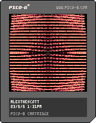

<h1>chr wave</h1>

</img>
</img>

``` Lua
-- alexthescott
-- 23/5/5 1:31pm
-- chr wave

poke(24364,7)t=0p={}for x=0,16do?"\^!5f100☉8🅾️◆"
cls()for y=0,16do
add(p,{x*5,y*5})end
end::_::for i=0,999do
x,y=rnd(128),rnd(128)c=pget(x,y)if(c>0)pset(x,y,c-1)end
for e in all(p)do?'"',e[1]+cos(t+e[1]/256+e[2]/512)*8,e[2]+sin(t/5+e[2]/256+e[1]/512)*8,4
end
t+=.002flip()goto _
```