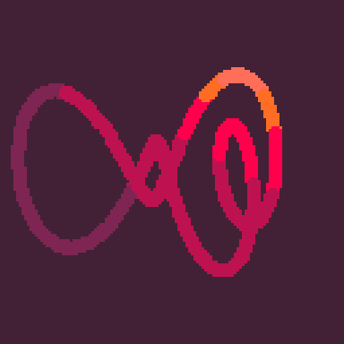

<h1>colorful squiggle</h1>

</img>
</img>

``` Lua
-- colorful squiggle
-- alexthescott
-- 22/3/12

?"\^!5f10🐱2☉8웃🅾️:♥"
d=128
l,f,q,r,c,s=d*4,0,rnd(),rnd(),cos,sin cls()_set_fps(60)::_::cls()
for i=1,l do
u=i/d
v=f/l
x=(1+(c(u/4))/2)*64+c(i/l+v*q)*6+c(u+v*r)*8+c(u/2+v)*12y=(1+(s(u)/2)/2)*64+s(i/l+v*r)*6+s(u+v*q)*8+s(u/4+v/8/r)*8
circfill(x,y,2,1+x/y/0.7)end
f+=1flip()goto _
```
