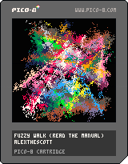

<h1>fuzzy walk</h1>

</img>
</img>

[fuzzy walk ipfs](https://cloudflare-ipfs.com/ipfs/QmZcRV3o38XMdiUK8uAUSGkr7Tm8dLZLAogcYnHUtHYQmv/)

``` Lua
-- fuzzy walk (read the manual)
-- alexthescott
-- 8/13/21

r=rnd
b=8
c=0
p={}
m=1

function ap()
	local d={}
	d.x=r(128-b*2)
	d.y=r(128-b*2)
	add(p,d)
end

ap()ap()

cls()
::♥::
if t()<2 then
	print("fuzzy walk",44,64)
else
	for i=1,#p-1do
		f=p[i]
		s=p[i+1]
		line(f.x,f.y,s.x,s.y,i)
	end
	
	if c%4==0 and c<200then
		ap()
		if m == -1 then
			print("\a-g2",0,0)
		end
	end
	
	for i=1,4000 do
		x, y = r(128), r(128)
		dx, dy = r(4)-2, r(4)-2
		pset(x, y, pget(dx+x, dy+y))
	end
	
	if c>=300 then
		cls()
		p={}
		c=0
	else
		c+=1
	end
	
	if btnp(4) or btnp(5) then
		m*=-1
	end
end
flip()
goto ♥
```