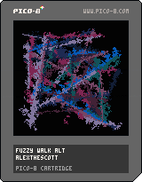

<h1>fuzzy walk alt</h1>

</img>
</img>

[fuzzy walk alt ipfs](https://cloudflare-ipfs.com/ipfs/Qmae2oER65wpLQo4TowYqgFRWXFcfAEhQsjU8YoD11KR1V/)

``` Lua
-- fuzzy walk alt
-- alexthescott
-- 8/13/21

r=rnd
b=8
c=0
p={}

col={1,13,2,129,130,131,140,141,7}
pal(col,1)

function ap()
	local d={}
	d.x=r(128-b*2)
	d.y=r(128-b*2)
	add(p,d)
end

ap()ap()

cls()
::♥::
if t()<2 then
	print("fuzzy walk alt",36,64,9)
else
	for i=1,#p-1do
		f=p[i]
		s=p[i+1]
		line(f.x,f.y,s.x,s.y,1+i%8)
	end
	
	if c%4==0 and c<200then
		ap()
	end
	
	for i=1,4000 do
		x, y = r(128), r(128)
		dx, dy = r(2)-1, r(2)-1
		pset(x, y, pget(dx+x, dy+y))
	end
	
	if c>=300 then
		cls()
		p={}
		c=0
	else
		c+=1
	end
	
end
flip()
goto ♥
```