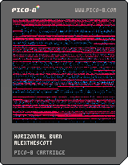

<h1>horizontal burn</h1>

</img>
</img>

[horizontal burn ipfs](https://cloudflare-ipfs.com/ipfs/QmbTYZJ8AWJjLKqw5vab279jpsLrxT5cuwHEYtQPsDTkvi/)

``` Lua
-- horizontal burn (memory bug fixed)
-- alexthescott
-- 9/2/21

p={8,136,130,11,139,131,12,140,129}
pal(p,1)

-- set btn delay
poke(0x5f5d, 30)

function new_screen()
	s={}
	for i=0,128 do
		add(s,i)
	end
	return s
end

function new_beam(c)
	if #screen<1 then
		screen=new_screen()
		global_index+=3
		global_index%=9
	end
	
	point=screen[1+rnd(#screen)\1]
	del(screen,point)

	b={}
	b.c=c
	b.d=rnd(2)\1
	
	-- left, right
	if b.d==0 then
			b.x=127
			b.y=point
			b.dx=-1
	else
			b.x=0
			b.y=point
			b.dx=1
	end
	
	b.draw=function(self)
		pset(self.x,self.y,self.c)
	end
	
	b.update=function(self)
		self.x+=self.dx
	end
	
	b.destroy=function(self)
		if self.x<0 or self.x>129 then
			del(beams,self)
		end
	end
	
	add(beams,b)
end

function burn()
	for p=0,256 do
		x=rnd(128)\1
		y=rnd(128)\1
		pc=pget(x,y)
		if pc!=0 and pc%3!=0 then
			if rnd(2)\1==0 then
				pset(x,y,pc+1)
			end
		elseif rnd(3)\1==0 then
			pset(x,y,0)
		end
	end
end

screen=new_screen()
beams={}
global_index=1

cls()

::♥::
if t()<2 then
	print("horizontal burn",34,64,1)
else
	burn()
	
	if t()%0.125==0 then
		for i=1,2 do 
			new_beam(global_index)
		end 
	end
	
	-- diy beam
	if btnp(4) or btnp(5) then
		for i=1,4 do 
			new_beam(global_index)
		end 
	end
	
	for b in all(beams) do
		b:draw()
		b:update()
		b:destroy()
	end
	
	flip()
end
goto ♥
```