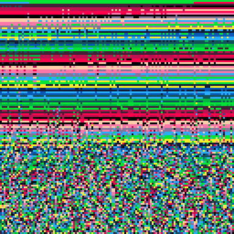

<h1>it's a feature</h1>

</img>
</img>

[it's a feature ipfs](https://cloudflare-ipfs.com/ipfs/QmZ1mXD7pR2HUMovZP4uMa4vtvXwmqjU1rTHyu5izWm7g6/)

``` Lua
--it's a feature (drippy sort)
--alexthescott
--8/24/21

p={8,136,130,11,139,131,12,140,129}
pal(p,1)
c=1

function burn()
	for p=0,2024do
		x=rnd(128)
		y=rnd(128)
		pc=pget(x,y)
		if (p-1)%3!=0 then
			--holding a magnet to 
			--a old computer type-beat? 
			pset(x,y+2,pc-1)
		end
	end
end

function add_brush()
	local b={}
	
	b.c=c
	b.x=0
	b.y=rnd(2)\1
	b.v=1
	
	b.update=function(slf)
	 slf.x+=slf.v
	end
	
	b.set_c=function(slf,c)
		slf.c=c
	end
	
	b.draw=function(slf)
		pset(slf.x,slf.y,slf.c)
	end
	
	b.destroy=function(slf)
		if slf.x>=128 then
			del(brushes,slf)
		end
	end
	
	add(brushes,b)
end

brushes={}
add_brush()

cls()
::♥::
if t()<2 then
	print("it's a feature",36,64,1)
else
	--burn() is our unexpected effect
	burn()
	
	if t()%3==0 then
		add_brush()
	end
	
	if t()%6==0 then
		for b in all(brushes) do
			b:set_c(c)
		end
		c+=3
		c%=10
	end
	
	for b in all(brushes) do
		b:draw()
		b:update()
		b:destroy()
	end
end

flip()
goto ♥

```