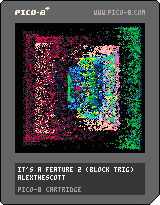

<h1>it's a feature 2</h1>

</img>
</img>

[it's a feature 2 ipfs](https://cloudflare-ipfs.com/ipfs/QmcYK72UfojHLYaFmTb8kMjkZao2snTbd9rVNMZhrJBPKR/)

``` Lua
-- it's a feature 2 (block trig)
-- alexthescott
-- 9/23/21 11:11pm

-- vert osc if day is even
-- hori osc if day is odd

p={8,136,130,11,139,131,12,140,129}
pal(p,1)

function new_obj(r)
	obj={}
	obj.col=4
	obj.point={x=64,y=64}
	obj.r=r
	obj.a=rnd()
	obj.span=.1
	obj.coin=stat(82)%2==0
	
	obj.draw=function(self)
		local p=self.point
		local a1=self.a-self.span/2
		local a2=self.a+self.span/2
		
		if self.coin then
			for at=a2,a1,-0.002 do
				x=p.x+cos(at/rnd())*self.r
				y=p.y+sin(at)*self.r
				pset(x,y,self.r/3)
			end
		else
			for at=a2,a1,-0.002 do
				x=p.x+cos(at)*self.r
				y=p.y+sin(at/rnd())*self.r
				pset(x,y,self.r/3)
			end
		end
	
		self.a+=0.004
	end

	
	return obj
end

function burn()
	for i=1,1200 do 
		x=rnd(128)\1
		y=rnd(128)\1
		pc=pget(x,y)
		if pc!=0 and pc%3!=0 then
			circfill(x,y,1,pc+1)
		else
			pset(x,y,0)
		end
	end
end

objs={}
fc=0

for i=1,20 do
	add(objs,new_obj(i*3))
end

cls()
::♥::
if t()<2 then
	print("it's a feature 2",32,64,1)
else
	burn()
	
	fc+=1
	
	if fc>=100 then
		fc=0
	end
	
	for obj in all(objs) do
		obj:draw()
	end
	
	flip()
end
goto ♥
```