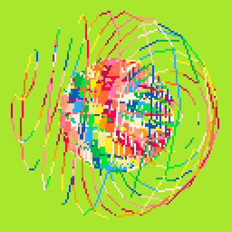

<h1>lofi 3d 3</h1>

</img>
</img>

[lofi 3d 3 ipfs](https://cloudflare-ipfs.com/ipfs/Qma38DmzYYJRxCXh9z3rFgsG5G6zShjUa9oPCN5qArUvtn/)

``` Lua
-- lofi 3d 3
-- alexthescott
-- 10/25/21 9:01pm

-- based on 3d demo
-- by @noahrosamilia

-- circle maths 
-- https://www.cmu.edu/biolphys/deserno/pdf/sphere_equi.pdf

-- new seed every day of the year 
srand(31*stat(81)+stat(82)) 

p1={7,6,135,10,138,11,139,3,131,12,140,1,129,130,128,0}
p2={7,135,10,9,15,143,142,137,14,136,8,2,130,133,128,0}
p3={7,15,143,142,14,8,136,137,9,10,135,138,11,139,12,140}

p={p1,p2,p3}
c=rnd(p)

pal(c,1)

function draw_shape(s)
	for i,l in ipairs(s[2]) do
		draw_line(s[1][l[1]],s[1][l[2]],i)
	end
end

function draw_line(p1,p2,c)
	x0,y0=project(p1)
	x1,y1=project(p2)
	line(x0,y0,x1,y1,c)
end

function draw_point(p,c)
	x,y=project(p)
	pset(x,y,c)
end

function project(p)
	-- calculate x,y and center it
	x=(p[1]-cam[1])*mult/(p[3]-cam[3])+127/2
	y=-(p[2]-cam[2])*mult/(p[3]-cam[3])+127/2
	return x,y
end

function translate_shape(s,t)
	-- copy shape, 0 out points,
	-- keep og lines
	ns={{},s[2]}
	-- add displacement to point
	for p in all(s[1])do
		add(ns[1],{p[1]+t[1],p[2]+t[2],p[3]+t[3]})
	end
	return ns
end

function rotate_shape(s,a,r)
	-- copy shape, 0 out points
	-- keep og lines
	ns={{},s[2]}
	for p in all(s[1])do
		add(ns[1],rotate_point(p,a,r))
	end
	return ns
end

function rotate_point(p,a,r)
	-- figure axis we're rotating
	if a==1 then
		x,y,z=3,2,1
	elseif a==2 then
		x,y,z=1,3,2
	elseif a==3 then
		x,y,z=1,2,3
	end
	
	_x=cos(r)*p[x]-sin(r)*p[y]
	_y=sin(r)*p[x]+cos(r)*p[y]
	np={}
	np[x]=_x
	np[y]=_y
	np[z]=p[z]
	return np
end

function limit_int(v,l)
	if v>0 then
		return min(v,l)
	else
		return max(v,-l)
	end
end

function burn()
	for p=0,384 do
		x=rnd(128)\1
		y=rnd(128)\1
		pc=pget(x,y)
		if pc!=0 then
			pset(x,y,pc-1)
		else
			pset(x,y,0)
		end
	end
end

function fuzz(big)
	if big then
		sz=10
		cnt=512
	else
		sz=3
		cnt=384
	end

	for p=0,cnt do
		x=rnd(128)\1
		y=rnd(128)\1
		pc=pget(x,y)
		if pc!=0 then
			for l=1,rnd(sz)\1 do
			pset(x-l,y,pc)
			pset(x+l,y,pc)
			end
		end		
	end
end

function forward()
	v=c[1]
	del(c,v)
	c[#c+1]=v
	pal(c,1)
end

function backward()
	v=c[#c]
	del(c,v)
	for i=#c+1,1,-1 do
		if i!=1 then
			c[i]=c[i-1]
		else
			c[i]=v
		end
	end
	pal(c,1)
end

function build_circ(shape,n,s)
	phi=2*(3-sqrt(5))
	for i=0,n do
		y=1-(i/(n-1))*2
		r=sqrt(1-y*y)
		theta=phi*i
		x=cos(theta)*r
		z=sin(theta)*r
		add(shape[1],{x*s,y*s,z*s})
	end
	
	for i=1,#shape[1]-2 do
		add(shape[2],{i,i+2})
	end
end

function centr_circ(r,c)
		for x=0,128 do
			y=sqrt(r^2-(x-64)^2)+64
			line(x,128,x,y,c)
			line(x,0,x,128-y,c)
		end
end

for i=1,rnd()*16 do
	forward()
end

for p=1,24 do
	po={p,p+1}
end

cam={0,0,-1.5}
mult=64

cir1={{},{}}
cir2={{},{}}
build_circ(cir1,256,1)
build_circ(cir2,128,2/3)
cir2=rotate_shape(cir2,1,0.25)

burn_count=10+(50*rnd())\1
burn_var=3+(10*rnd())\1

cntr_dthr=rnd()<=0.25

a=1+rnd(2)\1
ac=(1+rnd(10)\1)*60

month=stat(81)
day=stat(82)
cls()
_set_fps(60)
::♥::
if t()<2 then
	print("lofi 3d 3",46,59,1)
	print(month.."/"..day,55,65)
else
	if btn(❎) and btn(🅾️) or 
		time()%burn_var==0 then
			burn_count=10+(50*rnd())\1
			burn_var=3+(10*rnd())\1
			centr_circ(64,0)
	elseif burn_count>0 then
		centr_circ(64,0)
		burn_count-=1
	else
		centr_circ(32,0)
		if cntr_dthr then
			fillp(0b0111010101111111)
			circfill(63,63,32,1)
			fillp()
		end
	end
	
	if btn(⬅️) then cam[1] -= 0.01 end
	if btn(➡️) then cam[1] += 0.01 end
	if btn(⬆️) then cam[2] += 0.01 end
	if btn(⬇️) then cam[2] -= 0.01 end
	if btn(❎) then cam[3] -= 0.01 end
	if btn(🅾️) then cam[3] += 0.01 end
	
	if btn(⬆️) and btn(⬇️) or
		btn(➡️) and btn(⬅️) then
			print("cam.x="..cam[1],0,0,2)
			print("cam.y="..cam[2],0,6,2)
			print("cam.z="..cam[3],0,12,2)
	end
	
	if ac<=0 then
		if a==1 then
			a=2
		else
			a=1
		end
		ac=(1+rnd(10)\1)*60
	else
		ac-=1
	end
	
	cir2=rotate_shape(cir2,a,0.004)
	cir1=rotate_shape(cir1,a,0.004)
	draw_shape(cir2)
	draw_shape(cir1)
end
flip()
goto ♥
```