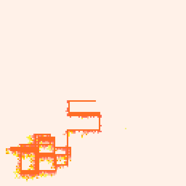
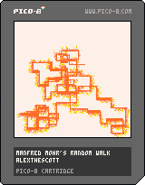

<h1>Manfred Mohr Random Walk Remix</h1>

</img>
</img>

From Manfred Mohr's [website](http://www.emohr.com/manfred7.html) under early algorithms. 

"A random walk of 100 alternating horizontal and vertical lines within an enclosed space is shown. The horizontal lines have a high percentage of a thicker width. The two drawings above show a continuous path, where lines change direction when they hit an edge of the space. The other two drawings (in the catalog) show broken paths which restart at a different position when they hit an edge."

``` Lua
-- alexthescott
-- manfred mohr's random walk
-- 22/11/3

-- new seed every day of the year 
srand(31*stat(81)+stat(82)) 

p1={7,6,135,10,138,11,139,3,131,12,140,1,129,130,128,0}
p2={7,135,10,9,15,143,142,137,14,136,8,2,130,133,128,0}
p3={7,15,143,142,14,8,136,137,9,10,135,138,11,139,12,140}

p={p1,p2,p3}
c=rnd(p)

function forward()
	v=c[1]
	del(c,v)
	c[#c+1]=v
	pal(c,1)
end

for i=1,1 do
	forward()
end


pal(c,1)

function draw_lines(lines, a_lines)
	for i=1,#lines-1 do
		line(lines[i][1],
							lines[i][2],
							lines[i+1][1],
							lines[i+1][2],
							7)
	end

	for l in all(a_lines) do
	s=l[1]
	e=l[2]
	c=l[4]
	dx=(e[1]-c[1])/5
	dy=(e[2]-c[2])/5
	if dx<0 and dx!=0 then dx-=0.8 else dx+=0.8 end
	if dy<0 and dx!=0 then dy-=0.8 else dy+=0.8 end
	c[1]+=dx
	c[2]+=dy
	if (abs(c[1]-e[1])<=1) c[1]=e[1]
	if (abs(c[2]-e[2])<=1) c[2]=e[2]
	line(s[1],s[2],c[1],c[2])
	if c[1]==e[1] and c[2]==e[2] then
			del(a_lines,l)
			add(lines,{s[1],s[2],l[3]})
			add(lines,{e[1],e[2],l[3]})
		end
	end
end

function add_line(lines, a_lines)
	dx=lines[#lines][1]
	nx=dx
	dy=lines[#lines][2]
	ny=dy
	a=4+rnd(18)/1
	if(rnd()<0.5)a*=-1
	if #lines>=2 then
		vert=lines[#lines][3]==false
	else
		vert=rnd()<0.5
	end
	if vert then
		thic=rnd()<0.1
		if dy+a<=2 then
			ny=dy-a*1.2
		elseif dy+a>=126 then
		 ny=dy-a*1.2
		else
			ny=dy+a
		end
		if thic then
			if #lines>=2 and dx>lines[#lines-1][1] then
				thic_x=-1
			else
				thic_x=1
			end
			add(a_lines,{{dx+thic_x*2,dy},{nx+thic_x*2,ny},vert,{dx,dy}})
			add(a_lines,{{dx+thic_x,dy},{nx+thic_x,ny},vert,{dx,dy}})
			add(a_lines,{{dx,dy},{nx,ny},vert,{dx,dy}})
			return true
		end
	else
		thic=rnd()<0.3
		if dx+a<=2 then
			nx=dx-a*1.2
		elseif dx+a>=126 then
		 nx=dx-a*1.2
		else
			nx=dx+a
		end
		if thic then
			if #lines>=2 and dy<lines[#lines-1][2] then
				thic_y=1
			else
				thic_y=-1
			end
		 add(a_lines,{{dx,dy+thic_y*2},{nx,ny+thic_y*2},vert,{dx,dy}})
			add(a_lines,{{dx,dy+thic_y},{nx,ny+thic_y},vert,{dx,dy}})
			add(a_lines,{{dx,dy},{nx,ny},vert,{dx,dy}})
			return true
		end
	end
	add(a_lines,{{dx,dy},{nx,ny},vert,{dx,dy}})
end

function delete_line(lines)
	if #lines<=1 then
		del(lines,lines[#lines])
		return true
	end
	del(lines,lines[#lines])
	return false
end

mohr_lines={{2+rnd(124)\1,2+rnd(124)\1}}
animating_lines={}
add_line(mohr_lines)
t=0
reverse=128
reset_state=false
_set_fps(60)
cls(0)
::_::

if btn(❎) then
	cls(0)
else
	for i=0,768 do
		x=rnd(128)
		y=rnd(128)
		if abs(x-64)<=1 and abs(y-64)<=1 then
			pset(x,y,0)
		end
		a=atan2((64-x)/128,(64-y)/128)
		x2=x-cos(a)*0.65
		y2=y-sin(a)*0.65
		pset(x2,y2,max(pget(x,y)-1,0))
	end
end

draw_lines(mohr_lines, animating_lines)
if (t)%12==0 and reset_state==false then
	add_line(mohr_lines, animating_lines)
	if (#mohr_lines>=256) then
		reset_state=true
	end
end
if reset_state==true then
	if reverse<=0 then
		if delete_line(mohr_lines) then
			reset_state=false
			reverse=128
			mohr_lines={{2+rnd(124)\1,2+rnd(124)\1}}
		end
	else
		reverse-=1
	end
end
t+=1
t%=3600
flip()
goto _
```