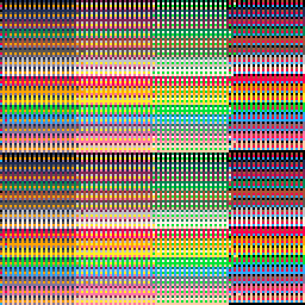

<h1>memory probe 1</h1>

</img>
</img>

[memory probe 1 ipfs](https://cloudflare-ipfs.com/ipfs/QmVsRSWQ95KBgY1X5RNMeeJ3XqcV8YveaRTjthAmCUnQsm/)

``` Lua
-- memory probe 1
-- alexthescott
-- 9/28/21 7:25am

fc=0

cls()
::♥::
if t()<2 then
	print("memory probe 1",36,64,1)
else
	fc+=0.005
	
	for i=0,1280 do
		p=0x6000+rnd()*8192
		v=peek(p)
		poke(p,p/16+fc)
	end
	
	if fc>=128 then
		fc=0
	end
end
flip()
goto ♥
```