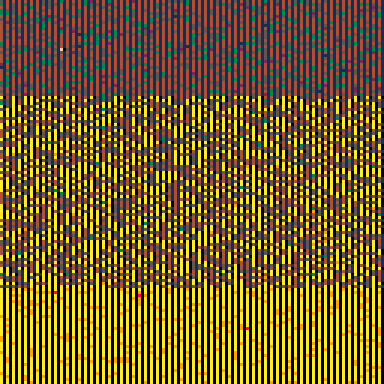

<h1>memory probe 2</h1>

</img>
</img>

[memory probe 2 ipfs](https://cloudflare-ipfs.com/ipfs/Qme3u4pzWXDeUxNFQhC3HRxhBwf59eeJk6NchwVN6978dk/)

``` Lua
-- memory probe 2
-- alexthescott
-- 9/28/21 7:48am

fc=0
t=0

cls()
::♥::
if time()<2 then
	print("memory probe 2",36,64,1)
else
	fc+=0.025
	
	for i=0,1024 do
		if t<3 then
			p=0x6000+(rnd()*6144)\1
			v=fc*2
		else
			p=0x6800+(rnd()*6144)\1
			v=fc
		end
	
		poke(p,v)
		t+=1
		
		if t>=6 then
			t=0
		end
	end
	
	if fc>=16 then
		fc=0
	end
end
flip()
goto ♥
```