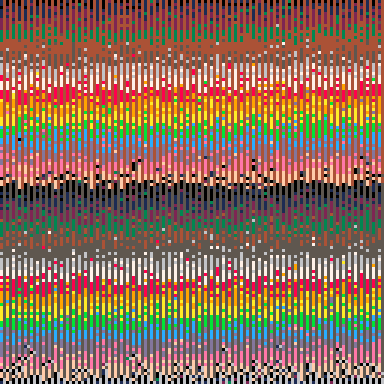

<h1>memory probe 3</h1>

</img>
</img>

[memory probe 3 ipfs](https://cloudflare-ipfs.com/ipfs/QmXKvEqncKGiBuFXxZ43GGqAxsNnf2wQ2miY7oe6oqwEGB/)

``` Lua
-- memory probe 3
-- alexthescott
-- 9/28/21 5:15pm

fc=0

cls()
::♥::
if t()<2 then
	print("memory probe 3",36,64,1)
else
	fc-=0.1
	
	for i=0,1280 do
		p=0x6000+rnd()*8192
		v=peek(p)
		poke(p,p/256+fc)
	end
	
	if fc<=-128 then
		fc=0
	end
end
flip()
goto ♥
```