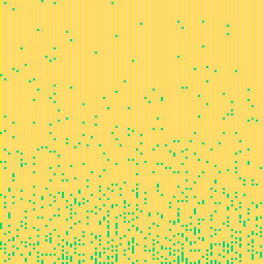

<h1>memory probe 4</h1>

</img>
</img>

[memory probe 4 ipfs](https://cloudflare-ipfs.com/ipfs/QmNyceTx2HtqNZ2vprRVUHyfQbyXrJr1PrVd4ECX8fvXGN/)

``` Lua
-- memory probe 4
-- alexthescott
-- 9/28/21 5:42pm

fc=0

cls()
::♥::
if t()<2 then
	print("memory probe 4",36,64,1)
else
	fc-=0.02
	
	for i=0,1280 do
		p=0x6000+rnd()*8192
		poke(p,(-2+p/peek(p)/64)+fc)
	end
	
	if fc<=-128 then
		fc=0
	end	
end
flip()
goto ♥
```