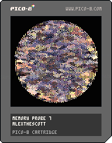

<h1>memory probe 7</h1>

</img>
</img>

[memory probe 7 ipfs](https://cloudflare-ipfs.com/ipfs/QmNyceTx2HtqNZ2vprRVUHyfQbyXrJr1PrVd4ECX8fvXGN/)

``` Lua
-- memory probe 7
-- alexthescott
-- 10/10/21 4:38pm

-- ⬅️➡️ change palette flavor

-- new seed every day of the year 
srand(31*stat(81)+stat(82))

p1={7,6,10,138,11,139,3,12,140,1,129,131,133,130,141,0}
p2={7,135,10,15,143,9,137,142,14,8,136,2,141,130,133,0}
p3={7,135,15,143,6,134,5,13,1,129,141,130,132,133,128,0}
p4={1,2,3,4,5,6,7,8,9,10,11,12,13,14,15,16}
p5={17,18,19,20,21,22,23,24,25,26,27,28,29,30,31,31}

p={p1,p2,p3}
pc=1+rnd(#p)\1
c=p[pc]
pal(c,1)

alt=rnd()
skip=false
dr_circ=false
burn_vari=rnd()<0.6
r=60-rnd(8)\1
cx=64
cy=64

function burn()
	for i=1,256 do
		p=0x6000+rnd(8128)\1
		poke(p+1,peek(p)+1)
		if burn_vari then
			poke(p-1,peek(p)+1)
		end
		poke(p-64,peek(p)+1)
		poke(p+64,peek(p)+1)
	end
end

function forward()
	v=c[1]
	del(c,v)
	c[#c+1]=v
	pal(c,1)
end

function backward()
	v=c[#c]
	del(c,v)
	for i=#c+1,1,-1 do
		if i!=1 then
			c[i]=c[i-1]
		else
			c[i]=v
		end
	end
	pal(c,1)
end

for i=1,rnd()*16 do
	forward()
end

month=stat(81)
day=stat(82)

cls()
_set_fps(60)
::♥::
if t()<2 then
	print("memory probe 7",36,59,1)
	print(month.."/"..day,55,65)
elseif t()==2 then
	if alt<0.2 then
		--mirror top left qrt
		poke(0x5f2c,7)
		dr_circ=rnd()<0.5
	elseif alt<0.4 then
		--mirror top half
		poke(0x5f2c,6)
		dr_circ=rnd()<0.5
	elseif alt<0.6 then
		--mirror left half
		poke(0x5f2c, 5)
		dr_circ=rnd()<0.5
	elseif alt<0.7 then
		--zoom
		camera(32,32)
		r=30-rnd(4)
		poke(0x5f2c, 3)
	elseif alt<0.725 then
		--chaos?
		skip=true
	end
else
	burn()
	
	if dr_circ then
		circ(cx,cy,r,1)
		circ(cx,cy,r-1,2)
	end
	
	if not skip then
		for x=0,128 do
			y=sqrt(r^2-(x-cx)^2)+cy
			line(x,128,x,y,0)
			line(x,0,x,128-y,0)
		end
	end
	
	if btnp(⬆️) or btnp(⬅️) then
		forward()
	end
			
	if btnp(⬇️) or btnp(➡️) then
		backward()
	end
end
flip()
goto ♥
```