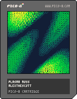

<h1>plasma moss</h1>

</img>
</img>

[plasma moss ipfs](https://bafybeifiixa6epzsdugmdfe5tzqliq2odlubi2weipswfz6xnrmd3a6dqi.ipfs.infura-ipfs.io/)

``` Lua
-- plasma moss
-- alexthescott
-- 21/1/25

pal({[0]=129,131,3,139,11,138,10,135},1)
cls()
_set_fps(60)
r=rnd
::♥::
for i=0,1024 do
	pset(r(128),r(128),0)
end
for x=0,128,4 do
for y=0,128,4 do
v=8*abs(sin(x/128+y/128)*sin(t()/64+x/256)+cos(y/256))
if(v>=1)circ(x,y,v,(v-1)/2)
end
end
flip()
goto ♥
```