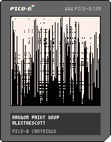

<h1>random paint drop</h1>

</img>
</img>

[random paint drop ipfs](https://cloudflare-ipfs.com/ipfs/QmcpvVPkEYBPCbeA6Dhhbo2eR6hwqMg5ZCkgPhbaLSvPig/)

``` Lua
-- random paint drop
-- alexthescott
-- 9/27/21 8:38am

-- new seed every day of the year
srand(31*stat(81)+stat(82))

function new_wave(d,c)
	w={}
	w.init=function(self)
		for p=1,128 do
			add(self.points,p)
		end
	end
	w.c=c
	w.d=d
	w.points={}
	w.step=0
	w:init()
	
	w.draw=function(self)
		if self.d==0 then
			for p in all(self.points) do
				pset(p,self.step,self.c)
			end
		elseif self.d==1 then
			for p in all(self.points) do
				pset(128-self.step,p,self.c)
			end
		elseif self.d==2 then
			for p in all(self.points) do
				pset(p,128-self.step,self.c)
			end
		elseif self.d==3 then
			for p in all(self.points) do
				pset(self.step,p,self.c)
			end
		end
	end
	
	w.update=function(self)
		move=1+(.75*(#self.points/32)\1)
		
		if #self.points>=move then
			for i=1,move do
				self.step+=1
				rnd_index=rnd(#self.points)\1
				del(self.points,self.points[rnd_index])
				self:draw()
			end
		end
	end
	
	return w
end

month=stat(81)
day=stat(82)
col_count=1
col=7
wave=new_wave(rnd(4)\1,col)

_set_fps(60)

cls()
::♥::
if t()<2 then
	print("random paint drop",30,59,7)
	print(month.."/"..day,55,65)
else
	wave:draw()
	wave:update()
	
	if #wave.points<=1 then
		local d=wave.d
		d+=1
		d%=4
		col_count+=1
		if col_count>=4 then
			col_count=1
			col= col==7 and 0 or 7
		end
		wave=new_wave(d,col)
	end
end
flip()
goto ♥
```