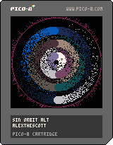

<h1>sin orbit alt</h1>

</img>
</img>

[sin orbit alt ipfs](https://cloudflare-ipfs.com/ipfs/QmXae8pafqpWScmAtumGjRELxQmembbF6LCxoNZP9iq482/)

``` Lua
-- sin orbit alt
-- alexthescott
-- 8/20/21

function burn()
	for p=0,512 do
		x=rnd(128)
		y=rnd(128)
		if pget(x,y)==13 and rnd(2)\1==1 then
			if x<64 then
				xd=-1
			else
				xd=1
			end
			if y<64 then
				yd=-1
			else
				yd=1
			end
			pset(x+xd,y+yd,13)
		else
			pset(x,y,0)
		end
	end
end

o={}
pal({7,6,134,5,1,129,13,141,133,131,140,6,2},1)

for n=6,1,-1 do
	add(o,{0,n/300})
end

cls()
::♥::
burn()
if t()<2 then
	print("sin orbit alt",38,64,1)
	circ(64,64,63,13)
else
	for n=1,6 do
		x=64+n*9*(sin(o[n][1]))
		y=64+n*9*(-cos(o[n][1]))
		circfill(x,y,5,n)
		circfill(-x+128,y,5,6+n)
		o[n][1]+=o[n][2]
		if o[n][1]>=2 then
			o[n][1]=0
		end
	end
	circ(64,64,63,13)
end
flip()
goto ♥
```