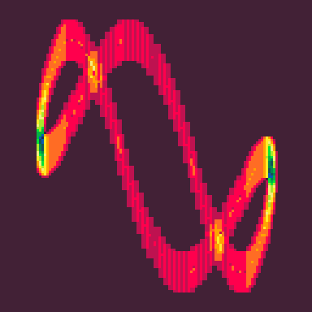
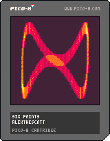

<h1>six points</h1>

</img>
</img>

``` Lua
-- six points
-- alexthescott
-- 22/7/9

?"\^!5f100🐱☉8웃9:♥⌂;⬅️3⬇️😐1"
_set_fps(60)
t=rnd()
::_::
cls(1)
for i=1,148 do
x=64+cos(i/148-t/16)*48
y=64+sin(.5*sin((0.5+i/148-t)))*48
line(x,y,pget(x,y)+1)
for v=x-1,x+1 do
for z=y-8,y+8 do
pset(v,z,pget(v,z)+1)
end
end
end
flip()
t+=0.0005
goto _
```