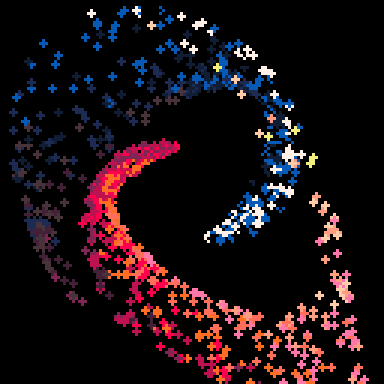

<h1>space</h1>

</img>
</img>

``` Lua
-- space
-- alexthescott

pal({[0]=0,140,129,1,133,130,2,136,8,137,142,14,143,15,135,7},1)

o={}
inc=0.021
for i=0,4,inc do
	for c=0,5 do
		r=32+(i/5)*112
		a=(i/8)
		p=c/2+rnd(a)
		add(o,{r,a,p})
	end
end

cls()
_set_fps(60)
::♥::
cls()
for i,ob in ipairs(o) do
	x=ob[1]*cos(ob[2])
	y=ob[1]*sin(ob[2])
	s=sin(ob[3])/2
	c=cos(ob[3])/2
	x=x*c-y*s+64
	y=x*s+y*c+64
	ob[2]+=inc/32
	circfill(x,y,1,1+ob[3]*15)
end

flip()
goto ♥
```
