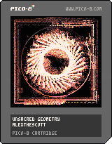

<h1>unsacred geometry</h1>

</img>
</img>

[unsacred geometry ipfs](https://ipfs.io/ipfs/QmZQxH6nbdysnWWhkzfD25T3sUXis5oUjoELTvZf7b8QXX/)

``` Lua
-- unsacred geometry
-- alexthescott
-- 23/3/19

-- new seed every day of the year 
srand(31*stat(81)+stat(82)) 

p1={[0]=129,1,133,130,2,136,8,137,142,14,143,15,135,7}
p2={[0]=0,128,130,2,129,1,131,140,12,139,138,10,135,7}
p3={[0]=0,128,130,133,5,132,4,142,137,14,143,15,135,7}
p={p1,p2,p3}
c=rnd(p)
pal(c,1)

-- framecount
f=rnd(1)
-- line count
v=64
-- geometry seed
q=30+rnd(22)\1
-- ants seed
g=rnd()

month=stat(81)
day=stat(82)

cls(0)
_set_fps(60)
::♥::
if t()<2 then
	print("unsacred geometry",30,59,7)
	print(month.."/"..day,55,65)
else
	-- party determine glitch rate
	-- and burn type (classic, radial)
	party=rnd()<(1+sin(0.5-f))/2
	
	-- burn method, ❎ will show
	-- skeleton of the sketch
	if not btn(❎) then
		for i=0,1500 do
			x=rnd(128)
			y=rnd(128)
			-- radial burn
			if not party then
				a=atan2((64-x)/128,(64-y)/128)
				x2=x-cos(a)
				y2=y-sin(a)
				pset(x2,y2,max(pget(x,y)-1,0))
			-- og burn
			else
				pset(x,y,max(pget(x,y)-1,0))
			end
		end
	else
		cls(0)
	end
	
	-- draw geometry
	-- rotate lines around a circle
	for i=f,v+f do
			-- change color if ❎ pressed
			pc=13
			if(btn(❎))pc=1
			a=i/v
			b=i/(v/q)
			c=(i+1)/v
			d=(i+1)/(v/q)
			x1=64+cos(a)*24+cos(b+f)*22
			y1=64+sin(a)*24+sin(b+f)*22
			x2=64+cos(c)*24+cos(d+f)*22
			y2=64+sin(c)*24+sin(d+f)*22
			line(x1,y1,x2,y2,pc)
	end
	
	-- glitch effect
	-- poke pushes screen to sprsheet
	if not btn(❎) then
		for i=0,1 do
			if rnd(0.5)<(1+sin(f/2))/2 then
				if f*100%8<=4 then
					w=3+rnd(10)
					h=10+rnd(86)
				else
					w=10+rnd(86)
					h=3+rnd(10)
				end
				x=rnd(128-w)
				y=rnd(128-h)
				xo=rnd(4)*(1-2*(rnd(2)\1))
				yo=rnd(4)*(1-2*(rnd(2)\1))
				sspr(x,y,w,h,x+xo,y+yo,w,h)
			end
		end
	end
	poke(0x5f55,0x6000,8192)
	
	-- draw colorful circle 
	for i=0,300 do
		a=f/8+i/300
		x=64+50*cos(a)
		y=64+50*sin(a)
		pset(x,y,1+i/24)
	end
	
	-- draw rotating square border
	-- ty john huges on stackoverflow for the maths
	-- https://math.stackexchange.com/questions/2468060/find-x-y-coordinates-of-a-square-given-an-angle-alpha
	for e=0,4 do
		for i=0,100 do
			gl=1
			if(g>0.25)gl=g
			a=f
			z=60-sin(f)-e*2
			k=max(abs(cos(a+i/100+e/8)),abs(sin(a+i/100+e/8)))
			xr=z*cos(f+i/100+gl*e/8)/k
			yr=z*sin(f+i/100+e/8/gl)/k
			pset(64+xr,64+yr,1+i/8)
		end
	end
	
	-- increment framecount
	f+=.00025
	
	if btn(❎) then
		flip()
	end
	
	-- nothing lasts forever...
	if f>=256 then
		extcmd("reset")
	end
end
goto ♥
```